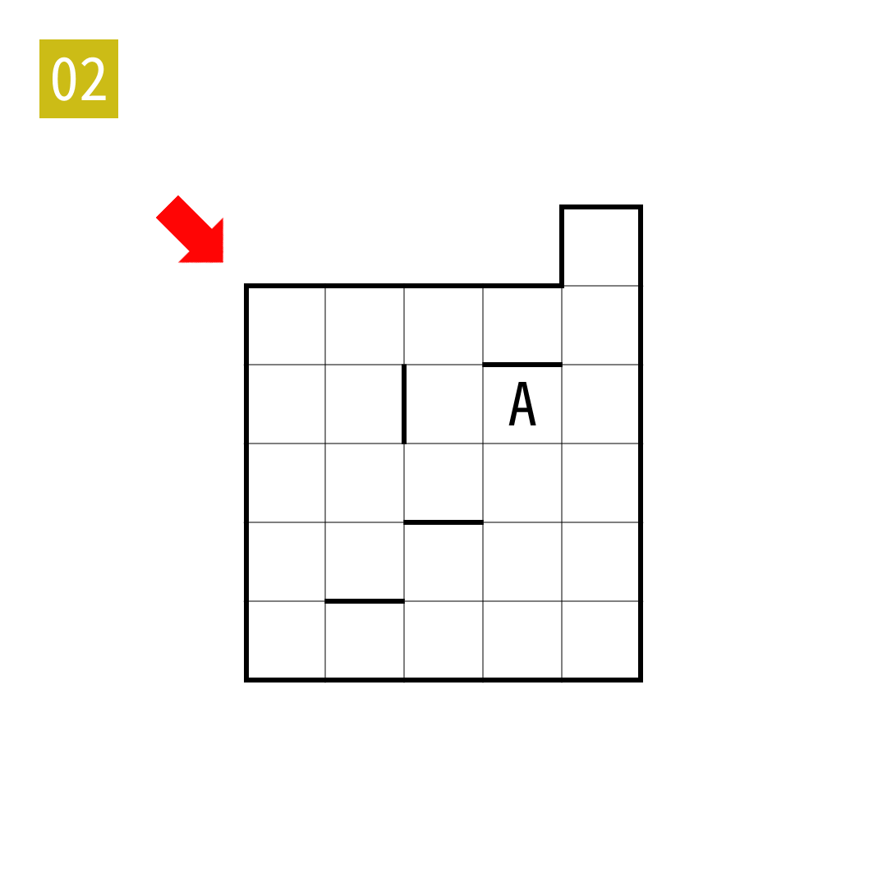

# 2025年度解谜能力测试 第 2 题

## 题面

## 答案

`MOUSE`

## 解析

填入A到Z使得A到Z形成一条路径。读对角线上的字母。

## 本地附件

- [e046e0a5a216486592814c0fafbfebc0.webp](../../../assets/static.cipherpuzzles.com/static/images/e046e0a5a216486592814c0fafbfebc0.webp)

来源：[https://ccbc16.cipherpuzzles.com/data/puzzle_script/c16-puzzle-solving-test.js#2](https://ccbc16.cipherpuzzles.com/data/puzzle_script/c16-puzzle-solving-test.js#2)
