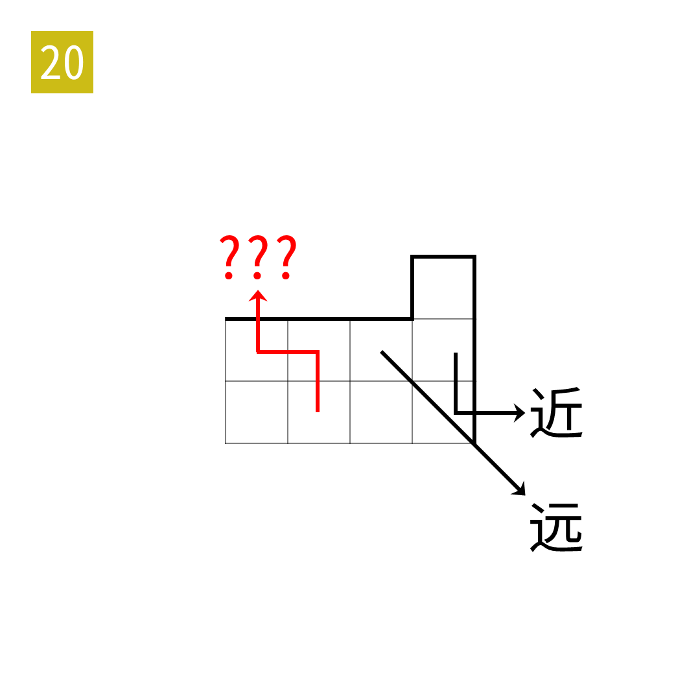

# 2025年度解谜能力测试 第 20 题

## 题面

## 答案

`SON`

## 解析

网格为元素周期表的右上角。

## 本地附件

- [fea3df97f6cf47139ebdb18dd30ba158.webp](../../../assets/static.cipherpuzzles.com/static/images/fea3df97f6cf47139ebdb18dd30ba158.webp)

来源：[https://ccbc16.cipherpuzzles.com/data/puzzle_script/c16-puzzle-solving-test.js#20](https://ccbc16.cipherpuzzles.com/data/puzzle_script/c16-puzzle-solving-test.js#20)
