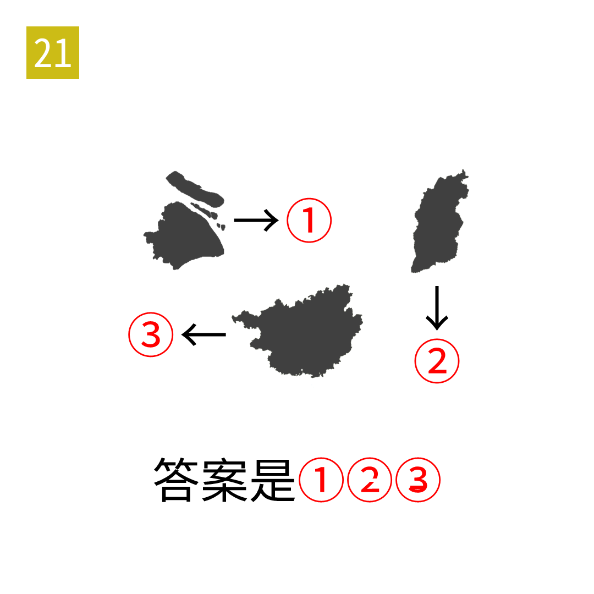

# 2025年度解谜能力测试 第 21 题

## 题面

## 答案

`户口本`

## 解析

剪影均为中国省级行政区，箭头表示提取简称对应方向的部件。注意最终答案对提取出的圆圈数字有修改。

## 本地附件

- [be28b2d4d8bd413f87377dcbbb6871ad.webp](../../../assets/static.cipherpuzzles.com/static/images/be28b2d4d8bd413f87377dcbbb6871ad.webp)

来源：[https://ccbc16.cipherpuzzles.com/data/puzzle_script/c16-puzzle-solving-test.js#21](https://ccbc16.cipherpuzzles.com/data/puzzle_script/c16-puzzle-solving-test.js#21)
