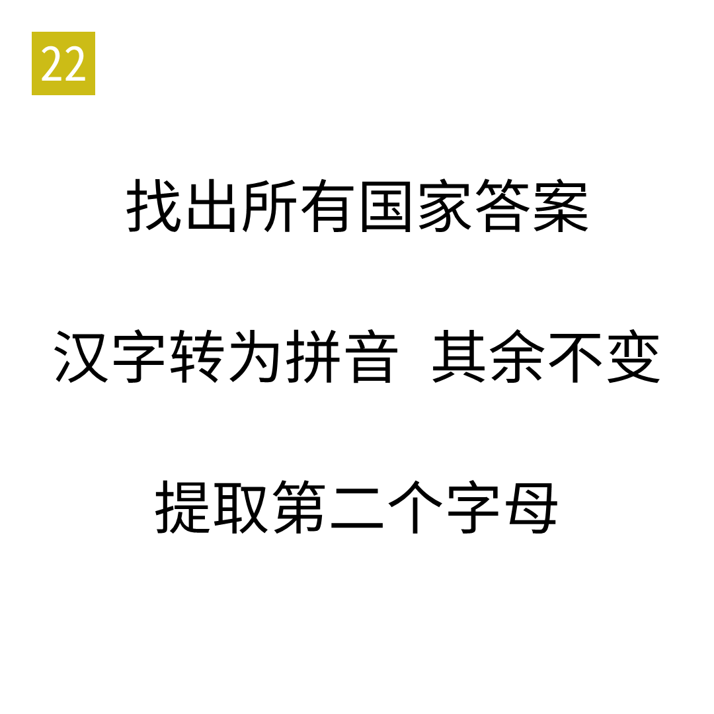

# 2025年度解谜能力测试 第 22 题

## 题面

## 答案

`ARM`

## 解析

所有国家答案为 04 大食，05 IRAN，08 阿曼。

## 本地附件

- [2e89e6c91bb348cfb4e59717cd40482e.webp](../../../assets/static.cipherpuzzles.com/static/images/2e89e6c91bb348cfb4e59717cd40482e.webp)

来源：[https://ccbc16.cipherpuzzles.com/data/puzzle_script/c16-puzzle-solving-test.js#22](https://ccbc16.cipherpuzzles.com/data/puzzle_script/c16-puzzle-solving-test.js#22)
