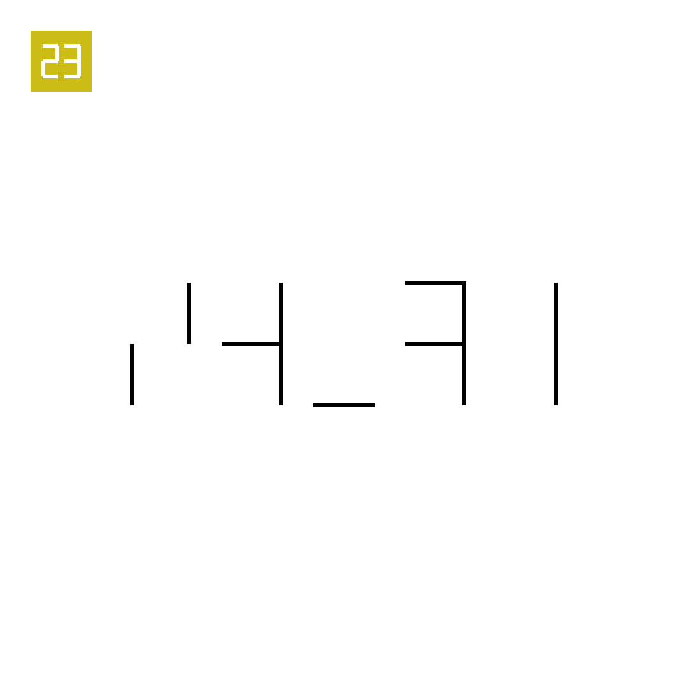

# 2025年度解谜能力测试 第 23 题

## 题面

## 答案

`SCALE`

## 解析

七段数码管取负形，象形字母。

## 本地附件

- [2b2ab547958240ba8dd36bdb924f5529.webp](../../../assets/static.cipherpuzzles.com/static/images/2b2ab547958240ba8dd36bdb924f5529.webp)

来源：[https://ccbc16.cipherpuzzles.com/data/puzzle_script/c16-puzzle-solving-test.js#23](https://ccbc16.cipherpuzzles.com/data/puzzle_script/c16-puzzle-solving-test.js#23)
