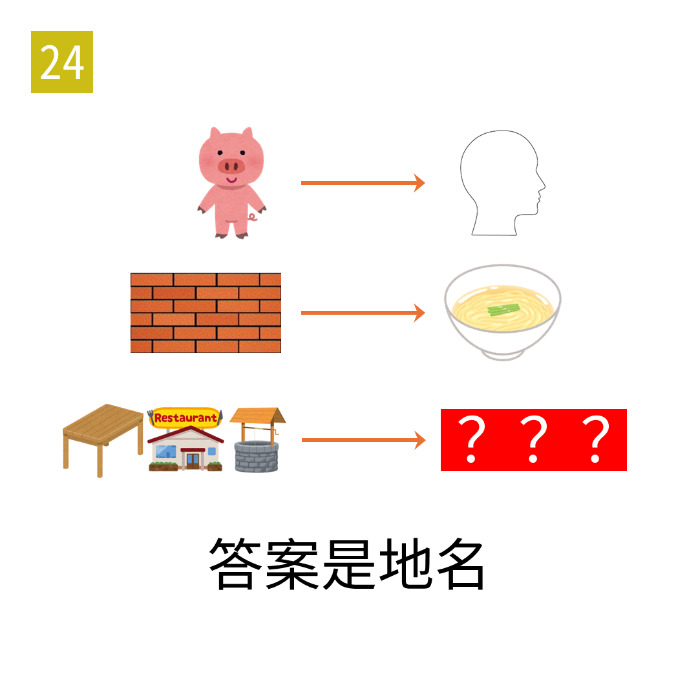

# 2025年度解谜能力测试 第 24 题

## 题面

## 答案

`张家口`

## 解析

箭头表示取物品的量词，例如猪变为头，墙变为面。最下行的三张图分别为桌子、饭店、井。

## 本地附件

- [d2d831d2bbd5482aa8adbac30a619833.webp](../../../assets/static.cipherpuzzles.com/static/images/d2d831d2bbd5482aa8adbac30a619833.webp)

来源：[https://ccbc16.cipherpuzzles.com/data/puzzle_script/c16-puzzle-solving-test.js#24](https://ccbc16.cipherpuzzles.com/data/puzzle_script/c16-puzzle-solving-test.js#24)
