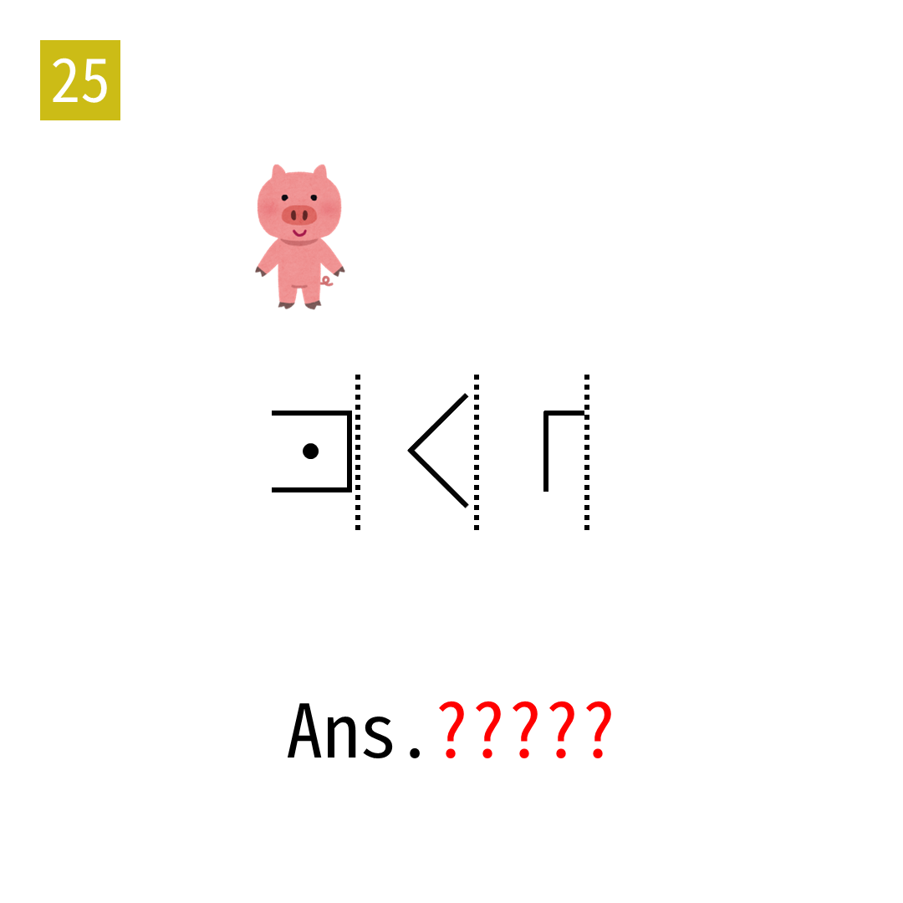

# 2025年度解谜能力测试 第 25 题

## 题面

## 答案

`MOUTH`

## 解析

虚线表示将左侧镜像。之后按猪圈密码提取。

## 本地附件

- [b7a187c1491d434894befb6928a3465d.webp](../../../assets/static.cipherpuzzles.com/static/images/b7a187c1491d434894befb6928a3465d.webp)

来源：[https://ccbc16.cipherpuzzles.com/data/puzzle_script/c16-puzzle-solving-test.js#25](https://ccbc16.cipherpuzzles.com/data/puzzle_script/c16-puzzle-solving-test.js#25)
