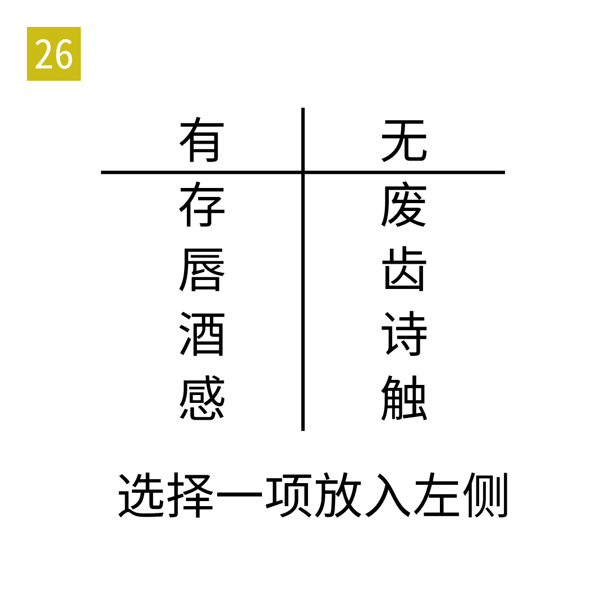

# 2025年度解谜能力测试 第 26 题

## 题面

## 答案

`异`

## 解析

左侧的字含有十二地支，右侧则没有。

## 本地附件

- [08ee820fb10d41918677199e6776b709.webp](../../../assets/static.cipherpuzzles.com/static/images/08ee820fb10d41918677199e6776b709.webp)

来源：[https://ccbc16.cipherpuzzles.com/data/puzzle_script/c16-puzzle-solving-test.js#26](https://ccbc16.cipherpuzzles.com/data/puzzle_script/c16-puzzle-solving-test.js#26)
