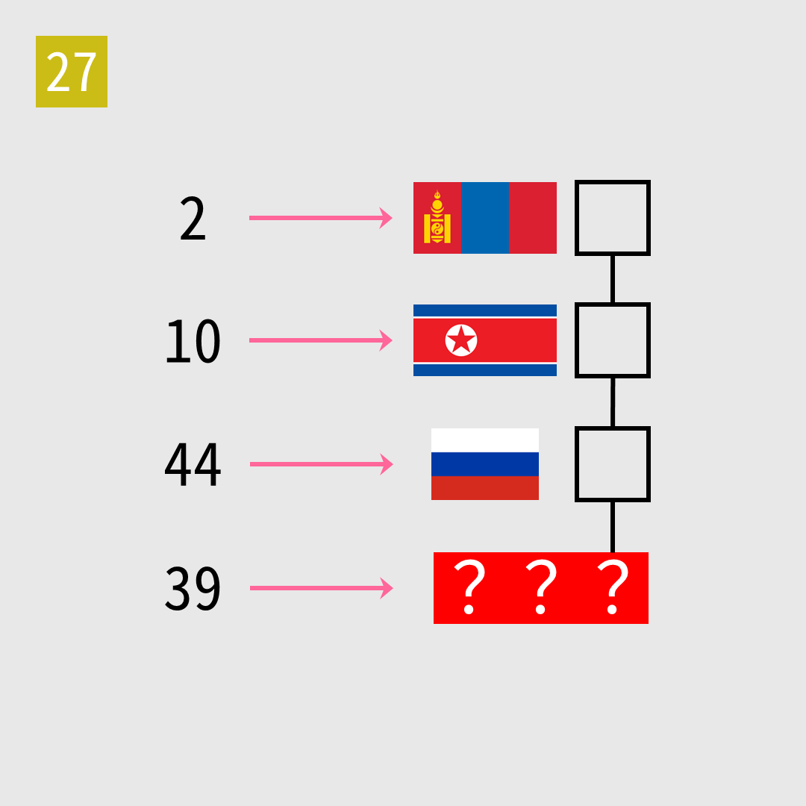

# 2025年度解谜能力测试 第 27 题

## 题面

## 答案

`阿昌族`

## 解析

箭头将数字转为对应的民族名称（五十六民族有官方的数字顺序）。

## 本地附件

- [cd15a729e2de4806a6c764859c2e9d3b.webp](../../../assets/static.cipherpuzzles.com/static/images/cd15a729e2de4806a6c764859c2e9d3b.webp)

来源：[https://ccbc16.cipherpuzzles.com/data/puzzle_script/c16-puzzle-solving-test.js#27](https://ccbc16.cipherpuzzles.com/data/puzzle_script/c16-puzzle-solving-test.js#27)
