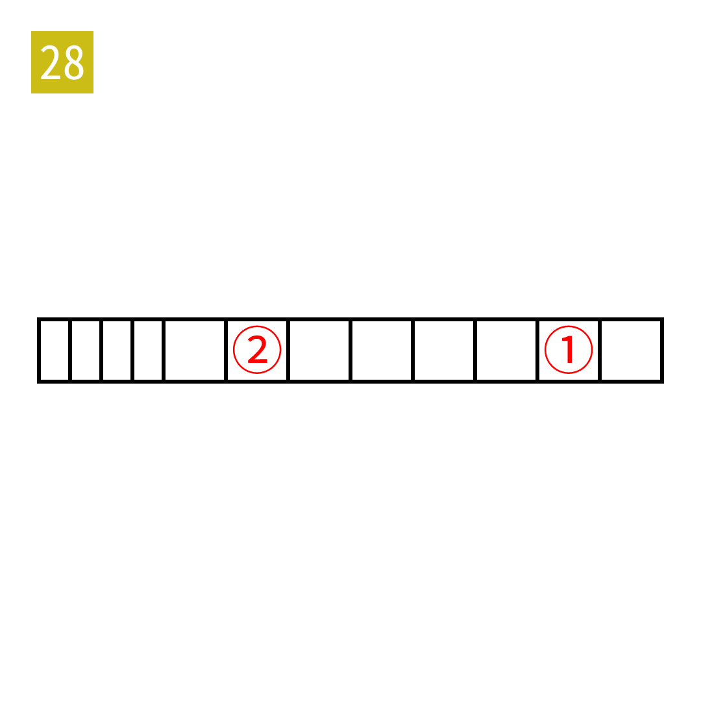

# 2025年度解谜能力测试 第 28 题

## 题面

## 答案

`测度`

## 解析

读标题中对应位置的字。

## 本地附件

- [83dc75894d304b33aaf39cb8e4e4f68c.webp](../../../assets/static.cipherpuzzles.com/static/images/83dc75894d304b33aaf39cb8e4e4f68c.webp)

来源：[https://ccbc16.cipherpuzzles.com/data/puzzle_script/c16-puzzle-solving-test.js#28](https://ccbc16.cipherpuzzles.com/data/puzzle_script/c16-puzzle-solving-test.js#28)
