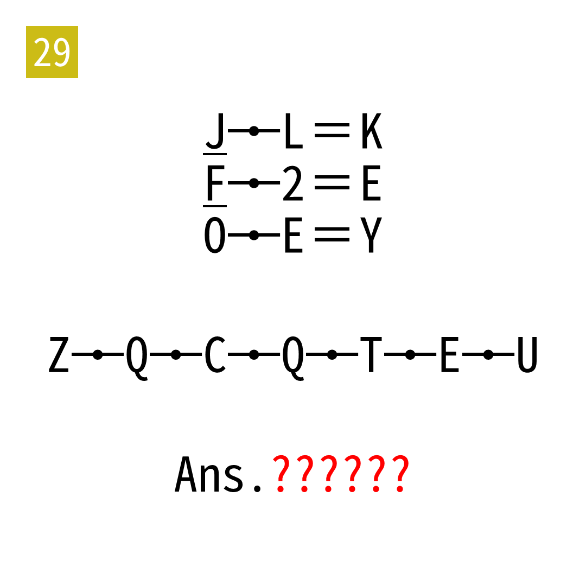

# 2025年度解谜能力测试 第 29 题

## 题面

## 答案

`ASSERT`

## 解析

读键盘上两字母之间中点位置的字母。

## 本地附件

- [5625c8659bbd4eafbf07a46529ffc189.webp](../../../assets/static.cipherpuzzles.com/static/images/5625c8659bbd4eafbf07a46529ffc189.webp)

来源：[https://ccbc16.cipherpuzzles.com/data/puzzle_script/c16-puzzle-solving-test.js#29](https://ccbc16.cipherpuzzles.com/data/puzzle_script/c16-puzzle-solving-test.js#29)
