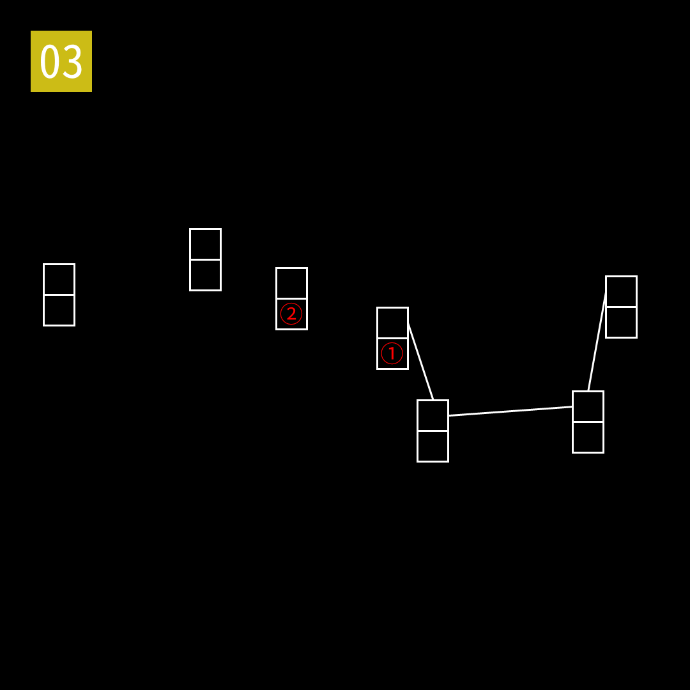

# 2025年度解谜能力测试 第 3 题

## 题面

## 答案

`权衡`

## 解析

填入北斗七星的名称。

## 本地附件

- [4b4ed5e04f8d4efcbca117978601f69b.webp](../../../assets/static.cipherpuzzles.com/static/images/4b4ed5e04f8d4efcbca117978601f69b.webp)

来源：[https://ccbc16.cipherpuzzles.com/data/puzzle_script/c16-puzzle-solving-test.js#3](https://ccbc16.cipherpuzzles.com/data/puzzle_script/c16-puzzle-solving-test.js#3)
