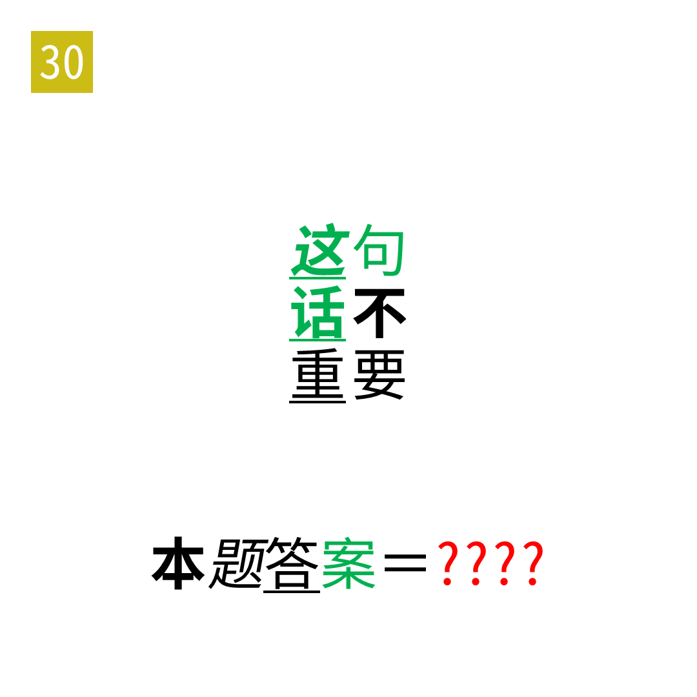

# 2025年度解谜能力测试 第 30 题

## 题面

## 答案

`HALF`

## 解析

提取盲文。

## 本地附件

- [3e9ccd531ff04929919ba1b0eaa877b2.webp](../../../assets/static.cipherpuzzles.com/static/images/3e9ccd531ff04929919ba1b0eaa877b2.webp)

来源：[https://ccbc16.cipherpuzzles.com/data/puzzle_script/c16-puzzle-solving-test.js#30](https://ccbc16.cipherpuzzles.com/data/puzzle_script/c16-puzzle-solving-test.js#30)
