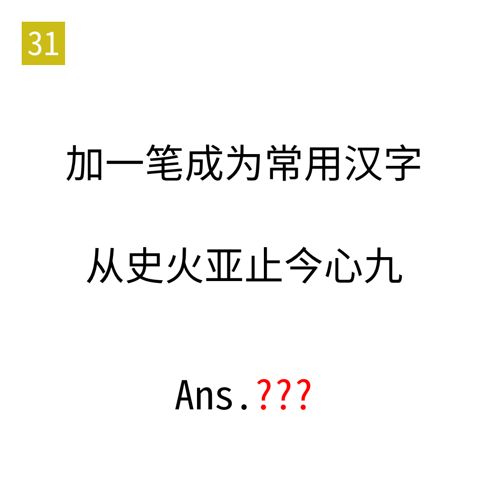

# 2025年度解谜能力测试 第 31 题

## 题面

## 答案

`ONE`

## 解析

提取摩斯，横为"-"，撇为"/"（分隔符），点为"."。

## 本地附件

- [4649e9385d29490387dcfeacddd2d30f.webp](../../../assets/static.cipherpuzzles.com/static/images/4649e9385d29490387dcfeacddd2d30f.webp)

来源：[https://ccbc16.cipherpuzzles.com/data/puzzle_script/c16-puzzle-solving-test.js#31](https://ccbc16.cipherpuzzles.com/data/puzzle_script/c16-puzzle-solving-test.js#31)
