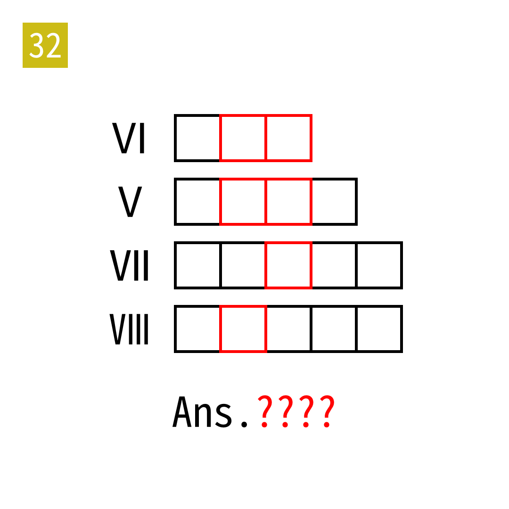

# 2025年度解谜能力测试 第 32 题

## 题面

## 答案

`IDEA`

## 解析

将罗马数字转为英文单词，提取之中的罗马数字，再A1Z26转换。

## 本地附件

- [362cd57d266846e984856bf97329cc43.webp](../../../assets/static.cipherpuzzles.com/static/images/362cd57d266846e984856bf97329cc43.webp)

来源：[https://ccbc16.cipherpuzzles.com/data/puzzle_script/c16-puzzle-solving-test.js#32](https://ccbc16.cipherpuzzles.com/data/puzzle_script/c16-puzzle-solving-test.js#32)
