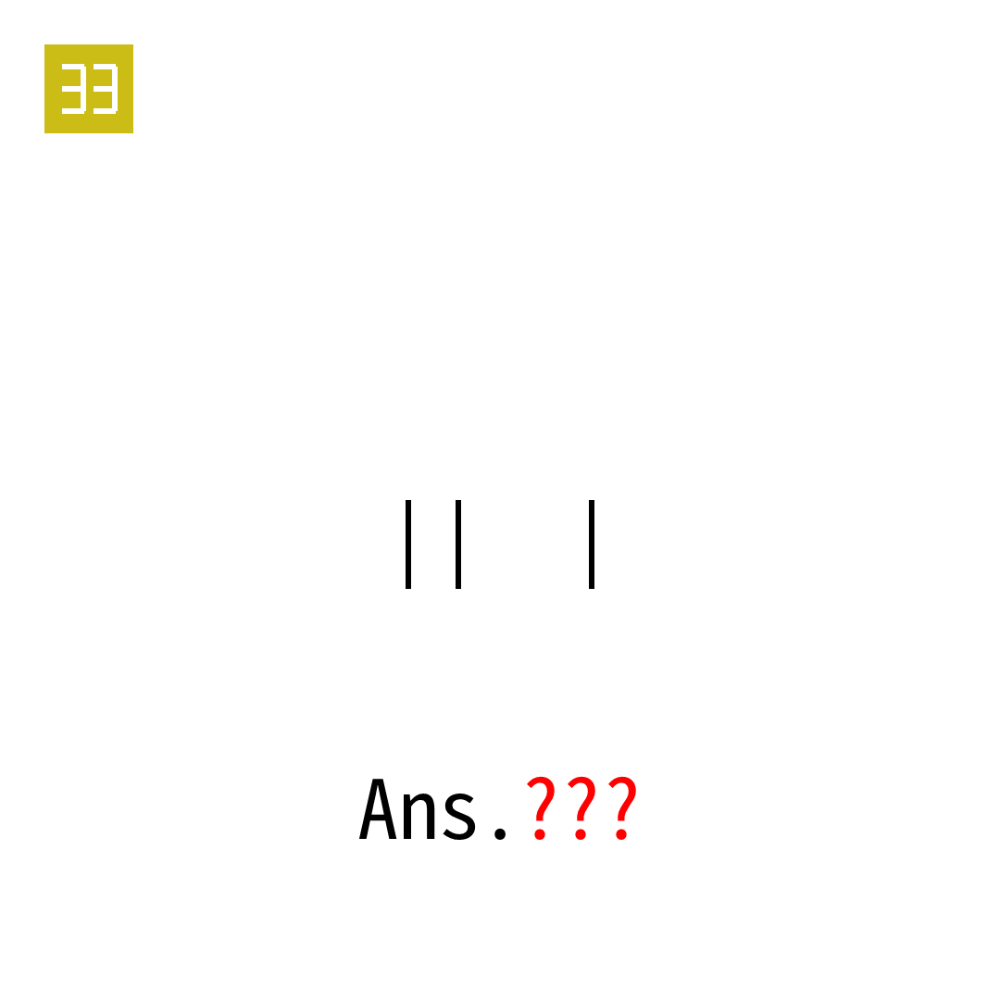

# 2025年度解谜能力测试 第 33 题

## 题面

## 答案

`EGG`

## 解析

标题提示本题机制与23相同。

## 本地附件

- [ce05deee0dba4017a9efc02e64a7ae21.webp](../../../assets/static.cipherpuzzles.com/static/images/ce05deee0dba4017a9efc02e64a7ae21.webp)

来源：[https://ccbc16.cipherpuzzles.com/data/puzzle_script/c16-puzzle-solving-test.js#33](https://ccbc16.cipherpuzzles.com/data/puzzle_script/c16-puzzle-solving-test.js#33)
