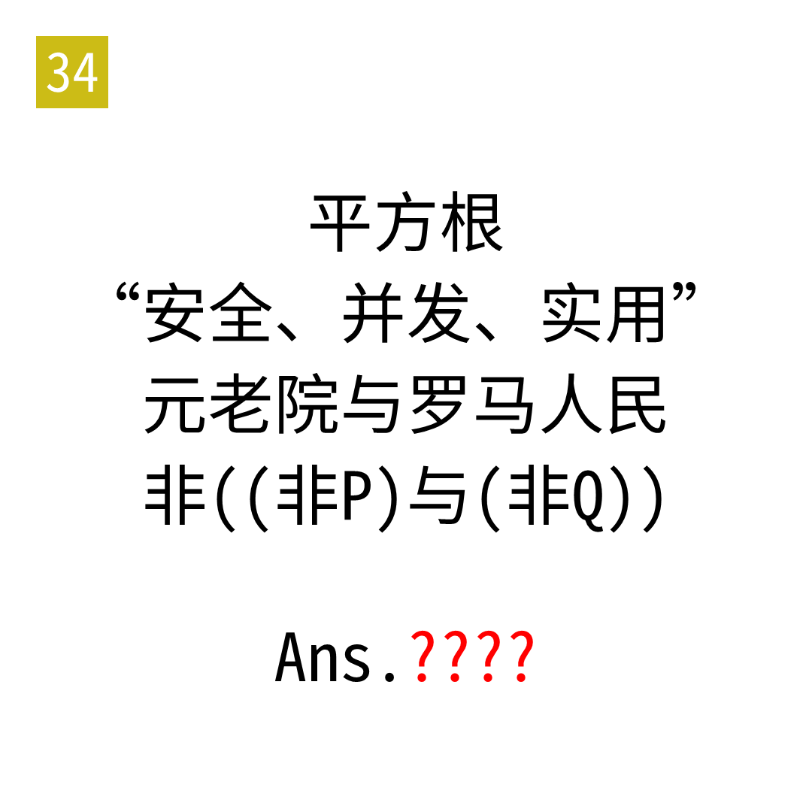

# 2025年度解谜能力测试 第 34 题

## 题面

## 答案

`MESH`

## 解析

四行分别对应SQRT、RUST、SPQR、PORQ。按照康托展开提取。

## 本地附件

- [7559909d65574be69fcbcc3c0f3a719a.webp](../../../assets/static.cipherpuzzles.com/static/images/7559909d65574be69fcbcc3c0f3a719a.webp)

来源：[https://ccbc16.cipherpuzzles.com/data/puzzle_script/c16-puzzle-solving-test.js#34](https://ccbc16.cipherpuzzles.com/data/puzzle_script/c16-puzzle-solving-test.js#34)
