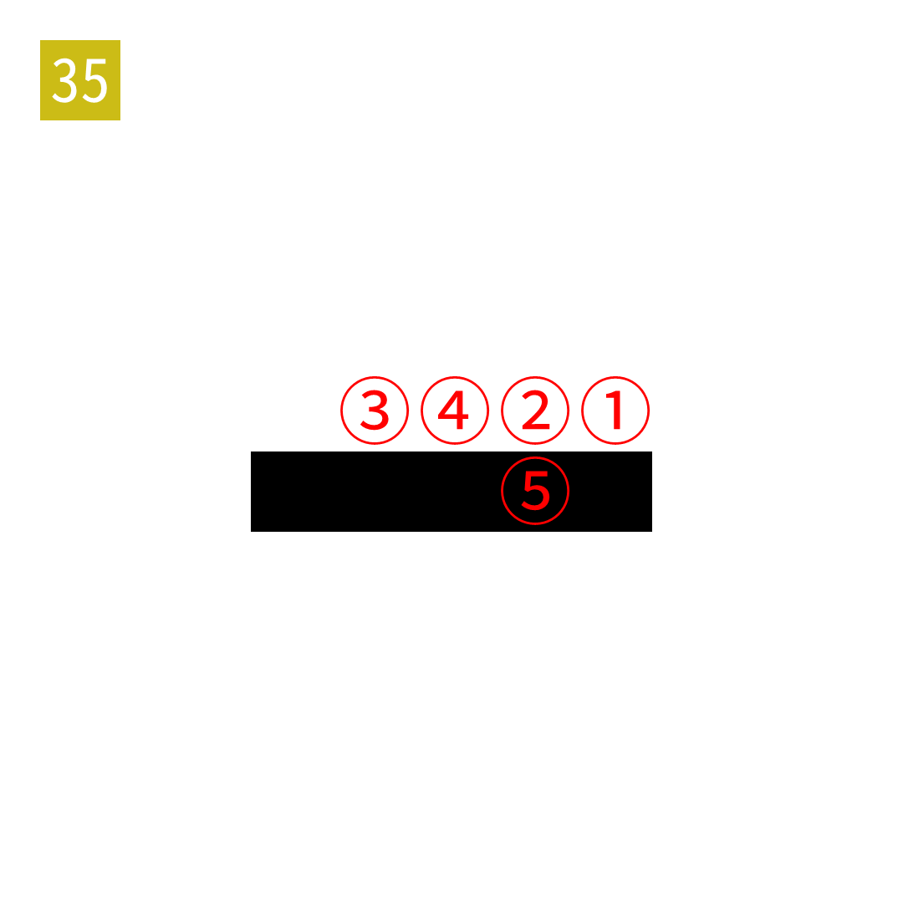

# 2025年度解谜能力测试 第 35 题

## 题面

## 答案

`ETHIC`

## 解析

第一行为WHITE，第二行为BLACK。

## 本地附件

- [6a402b7724e8434a87a92bb62c4ca30b.webp](../../../assets/static.cipherpuzzles.com/static/images/6a402b7724e8434a87a92bb62c4ca30b.webp)

来源：[https://ccbc16.cipherpuzzles.com/data/puzzle_script/c16-puzzle-solving-test.js#35](https://ccbc16.cipherpuzzles.com/data/puzzle_script/c16-puzzle-solving-test.js#35)
