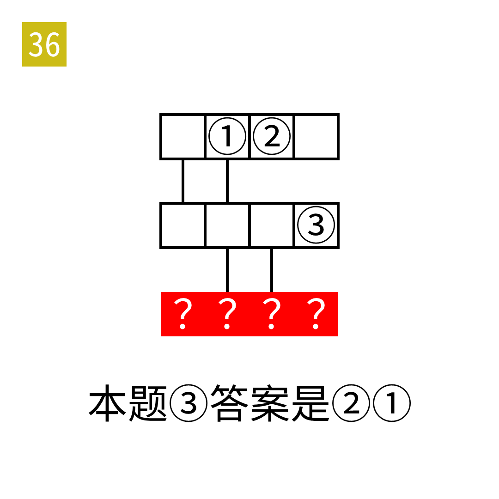

# 2025年度解谜能力测试 第 36 题

## 题面

## 答案

`恶语中伤`

## 解析

本题的答案是成语。第一行和第二行分别是一语成谶和一语中的。

## 本地附件

- [1e7a7e57b0bb444bace3bb958e5f6087.webp](../../../assets/static.cipherpuzzles.com/static/images/1e7a7e57b0bb444bace3bb958e5f6087.webp)

来源：[https://ccbc16.cipherpuzzles.com/data/puzzle_script/c16-puzzle-solving-test.js#36](https://ccbc16.cipherpuzzles.com/data/puzzle_script/c16-puzzle-solving-test.js#36)
