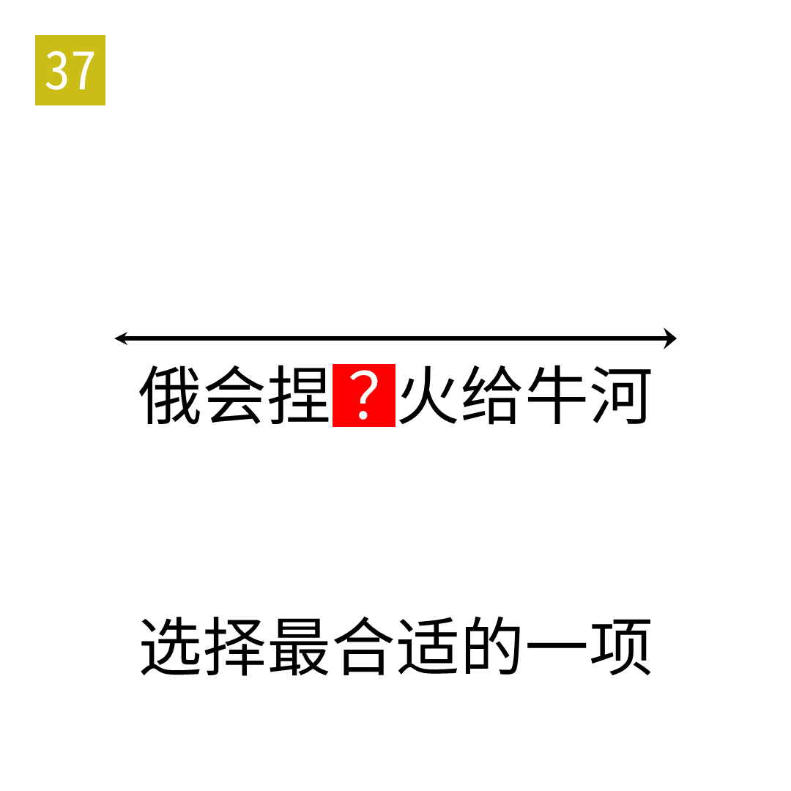

# 2025年度解谜能力测试 第 37 题

## 题面

## 答案

`构`

## 解析

转为拼音后文章为回文。

## 本地附件

- [f5fffae6887048e9baae95c43134d419.webp](../../../assets/static.cipherpuzzles.com/static/images/f5fffae6887048e9baae95c43134d419.webp)

来源：[https://ccbc16.cipherpuzzles.com/data/puzzle_script/c16-puzzle-solving-test.js#37](https://ccbc16.cipherpuzzles.com/data/puzzle_script/c16-puzzle-solving-test.js#37)
