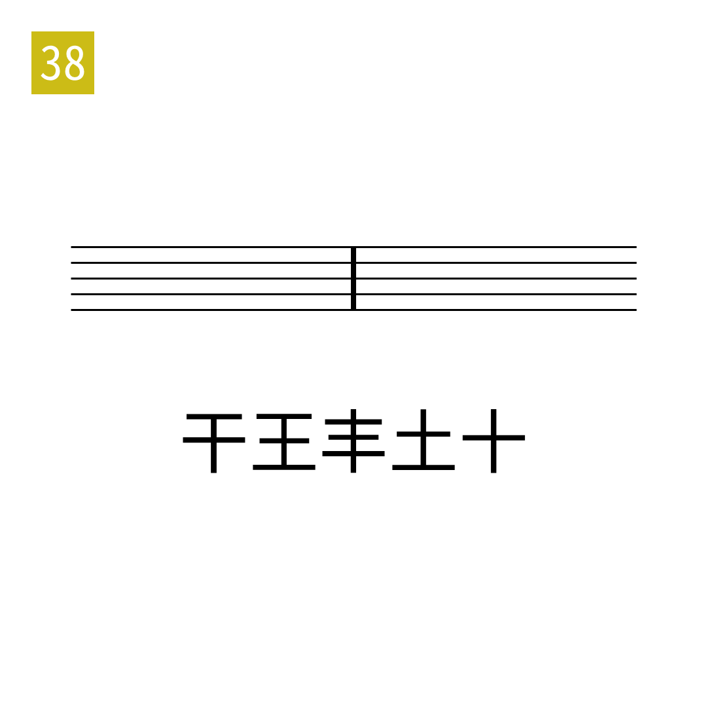

# 2025年度解谜能力测试 第 38 题

## 题面

## 答案

`TUNED`

## 解析

按照横的位置提取五位二进制。

## 本地附件

- [2fd11336796d4f28b23ed9461b50fb21.webp](../../../assets/static.cipherpuzzles.com/static/images/2fd11336796d4f28b23ed9461b50fb21.webp)

来源：[https://ccbc16.cipherpuzzles.com/data/puzzle_script/c16-puzzle-solving-test.js#38](https://ccbc16.cipherpuzzles.com/data/puzzle_script/c16-puzzle-solving-test.js#38)
