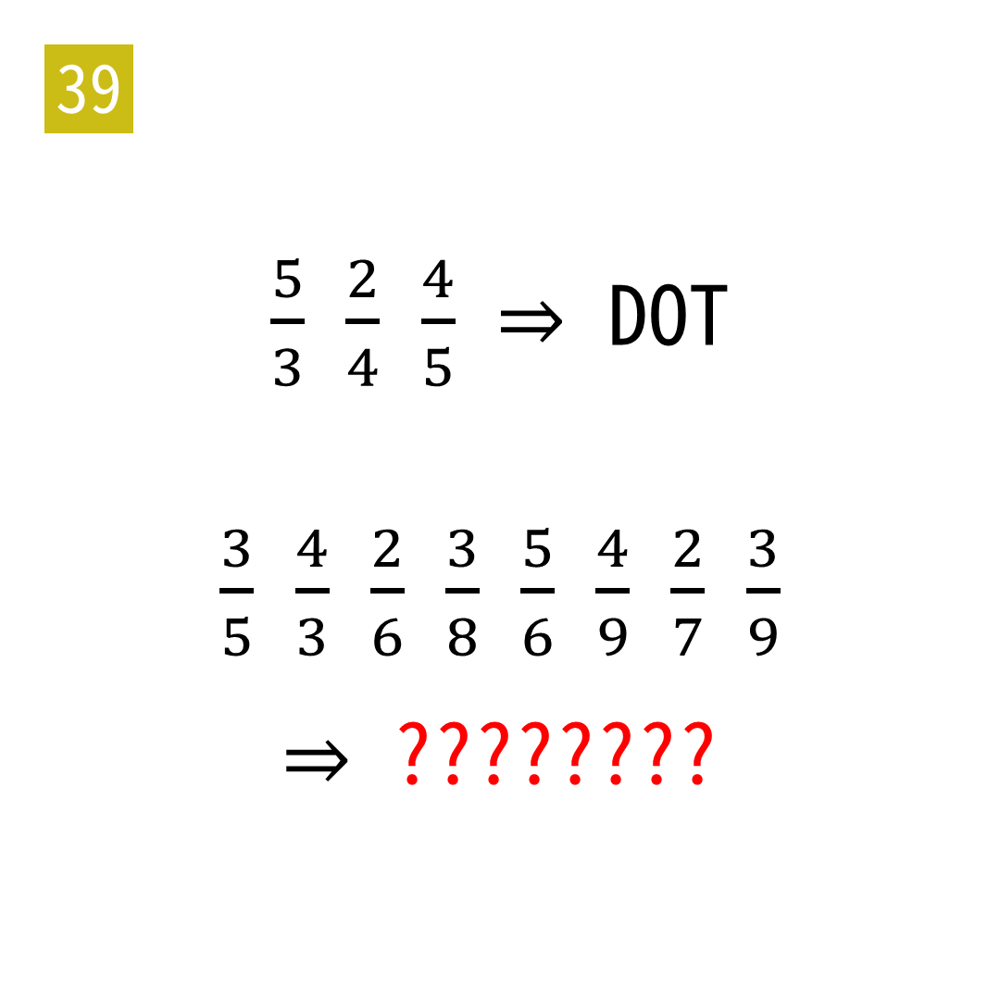

# 2025年度解谜能力测试 第 39 题

## 题面

## 答案

`FRIGHTEN`

## 解析

a/b表示提取b的序数词的第a位。

## 本地附件

- [2baf21d353d44e0089afcdb0bf49de7a.webp](../../../assets/static.cipherpuzzles.com/static/images/2baf21d353d44e0089afcdb0bf49de7a.webp)

来源：[https://ccbc16.cipherpuzzles.com/data/puzzle_script/c16-puzzle-solving-test.js#39](https://ccbc16.cipherpuzzles.com/data/puzzle_script/c16-puzzle-solving-test.js#39)
