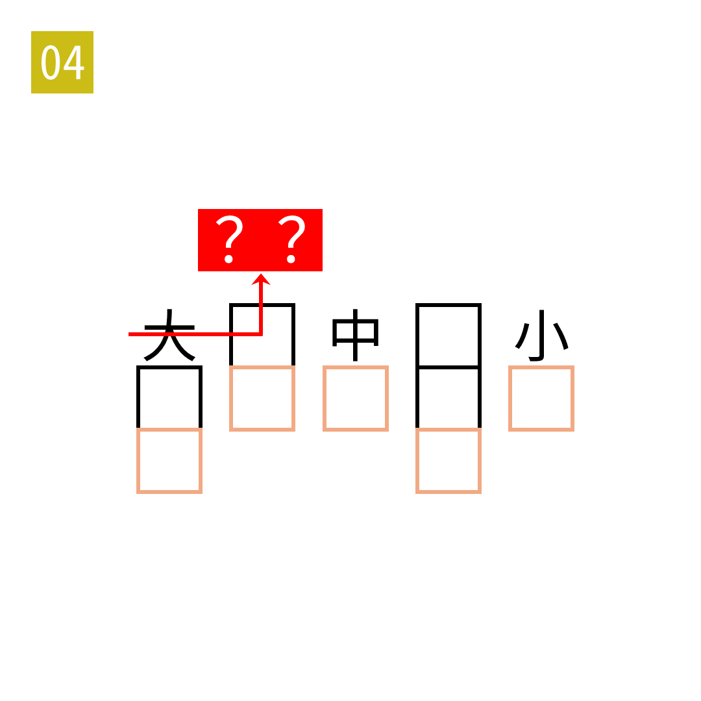

# 2025年度解谜能力测试 第 4 题

## 题面

## 答案

`大食`

## 解析

填入五指的名称。

## 本地附件

- [8e91fb4dcae3481786686634cf2ecf4e.webp](../../../assets/static.cipherpuzzles.com/static/images/8e91fb4dcae3481786686634cf2ecf4e.webp)

来源：[https://ccbc16.cipherpuzzles.com/data/puzzle_script/c16-puzzle-solving-test.js#4](https://ccbc16.cipherpuzzles.com/data/puzzle_script/c16-puzzle-solving-test.js#4)
