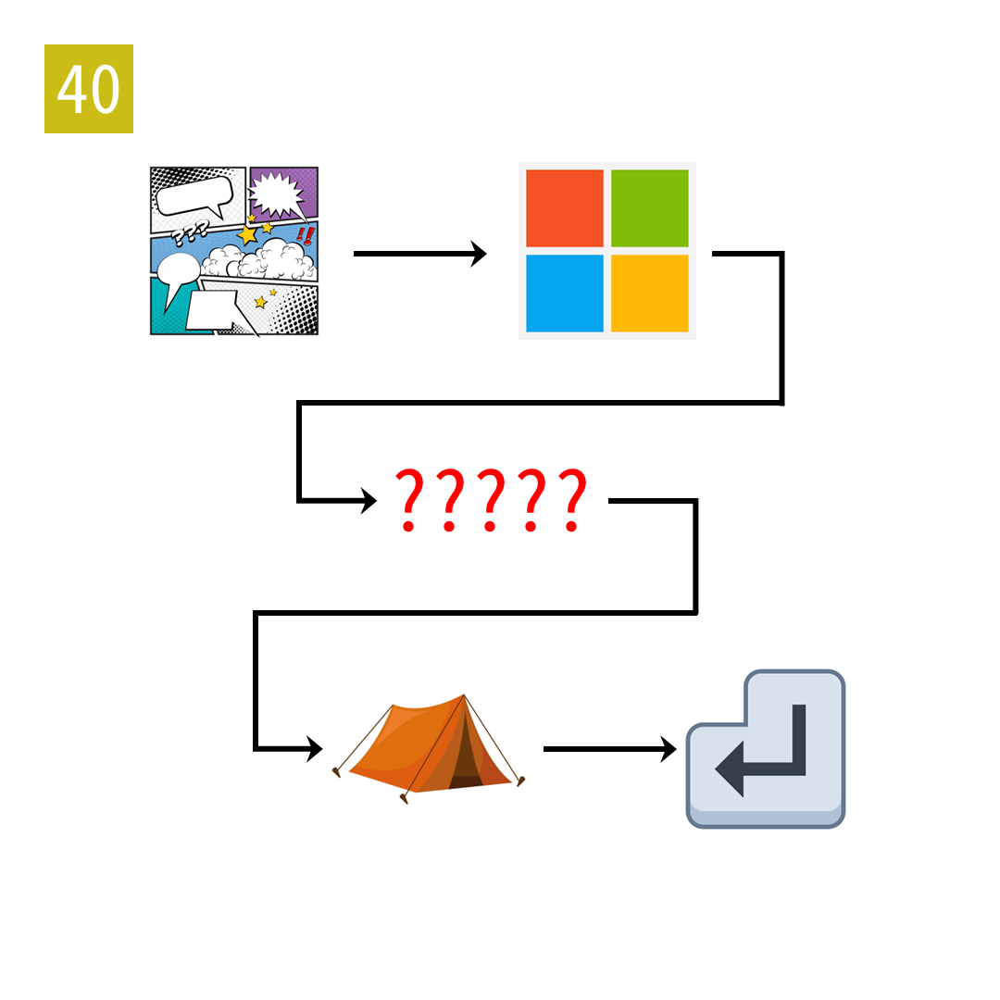

# 2025年度解谜能力测试 第 40 题

## 题面

## 答案

`OFTEN`

## 解析

箭头表示起点单词的后三字母和终点单词的前三字母相同。

## 本地附件

- [12bb54c2ec074659a68b316cc5999505.webp](../../../assets/static.cipherpuzzles.com/static/images/12bb54c2ec074659a68b316cc5999505.webp)

来源：[https://ccbc16.cipherpuzzles.com/data/puzzle_script/c16-puzzle-solving-test.js#40](https://ccbc16.cipherpuzzles.com/data/puzzle_script/c16-puzzle-solving-test.js#40)
