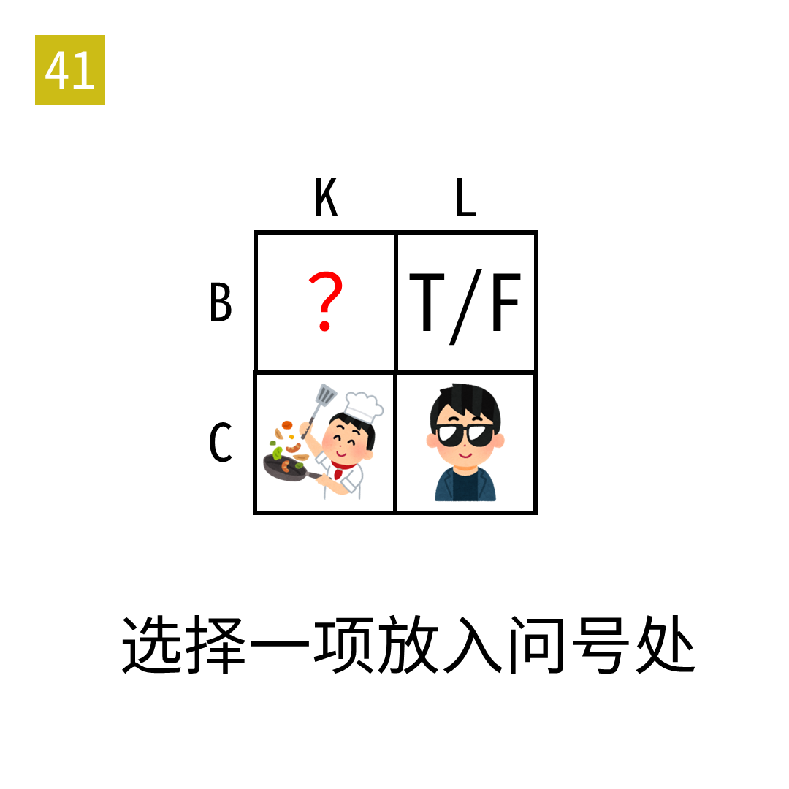

# 2025年度解谜能力测试 第 41 题

## 题面

## 答案

`体`

## 解析

四格分别是 BOOK、BOOL、COOK、COOL。选项要和编号数字一起读。

## 本地附件

- [fad335e7a31d4481a5b76a4755dc0a6d.webp](../../../assets/static.cipherpuzzles.com/static/images/fad335e7a31d4481a5b76a4755dc0a6d.webp)

来源：[https://ccbc16.cipherpuzzles.com/data/puzzle_script/c16-puzzle-solving-test.js#41](https://ccbc16.cipherpuzzles.com/data/puzzle_script/c16-puzzle-solving-test.js#41)
