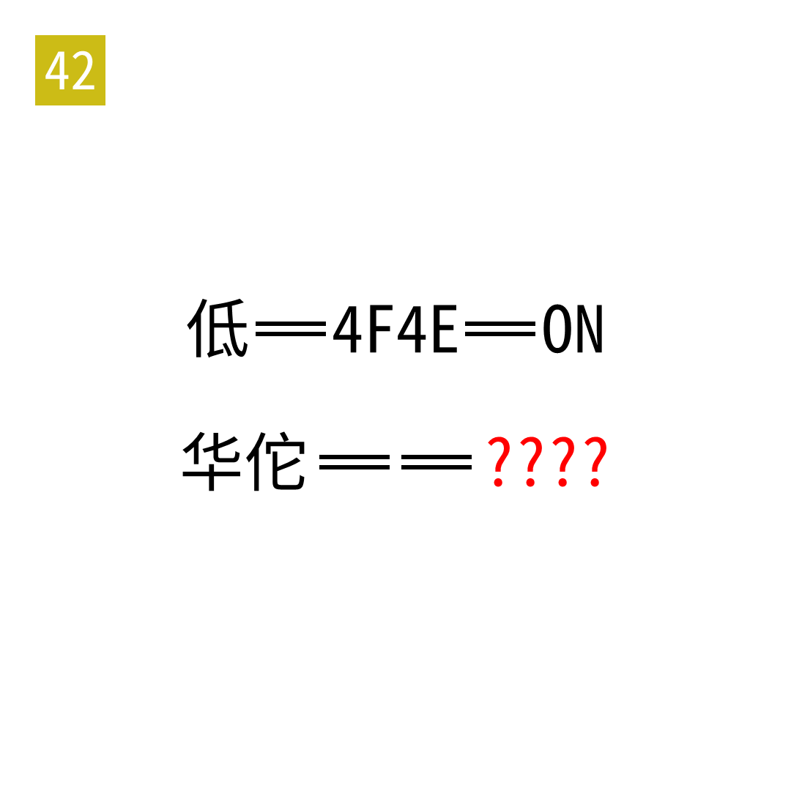

# 2025年度解谜能力测试 第 42 题

## 题面

## 答案

`SNOW`

## 解析

左侧转 Unicode，右侧转 ASCII。

## 本地附件

- [bc2fbfe97d634bf8a2e7169b6cf36e2b.webp](../../../assets/static.cipherpuzzles.com/static/images/bc2fbfe97d634bf8a2e7169b6cf36e2b.webp)

来源：[https://ccbc16.cipherpuzzles.com/data/puzzle_script/c16-puzzle-solving-test.js#42](https://ccbc16.cipherpuzzles.com/data/puzzle_script/c16-puzzle-solving-test.js#42)
