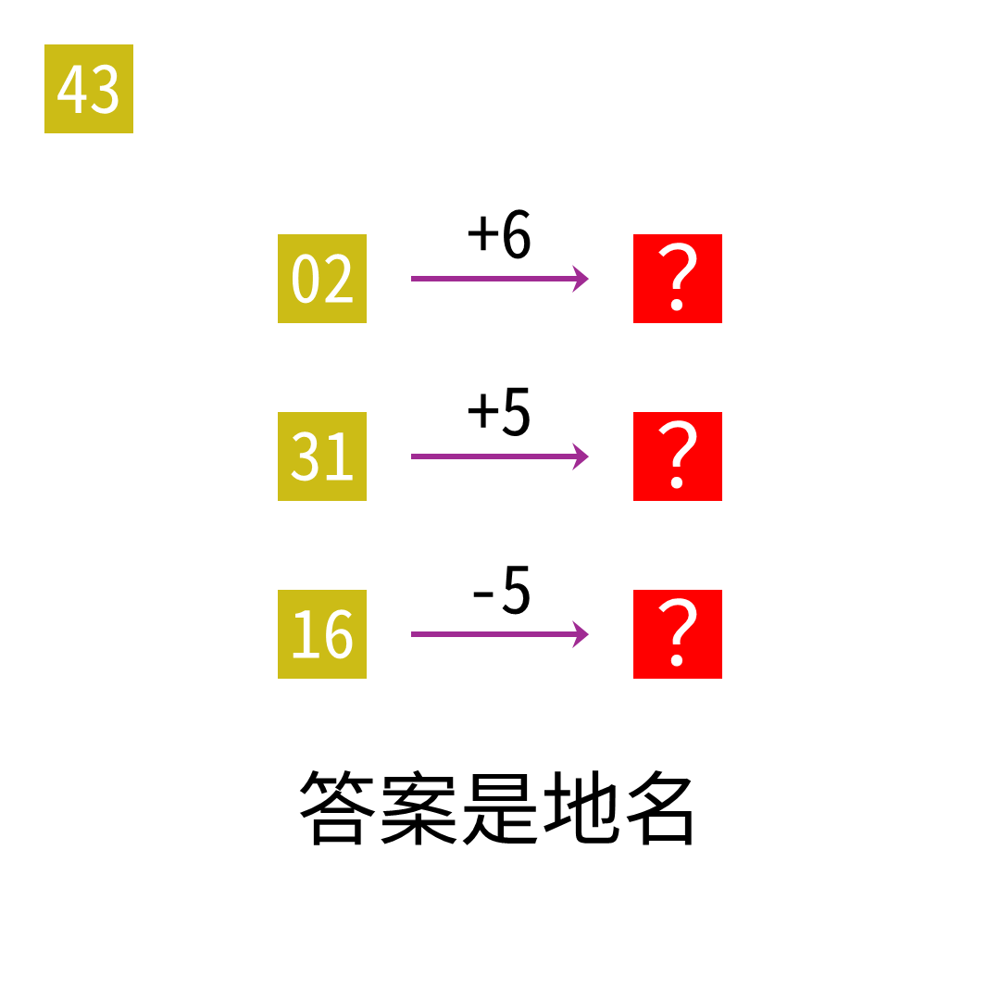

# 2025年度解谜能力测试 第 43 题

## 题面

## 答案

`马六甲`

## 解析

每个起点单词在一个有序集合内，箭头表示按数字移动后的集合元素。

## 本地附件

- [c7c68b894ad9461d8e093b54acfb2752.webp](../../../assets/static.cipherpuzzles.com/static/images/c7c68b894ad9461d8e093b54acfb2752.webp)

来源：[https://ccbc16.cipherpuzzles.com/data/puzzle_script/c16-puzzle-solving-test.js#43](https://ccbc16.cipherpuzzles.com/data/puzzle_script/c16-puzzle-solving-test.js#43)
