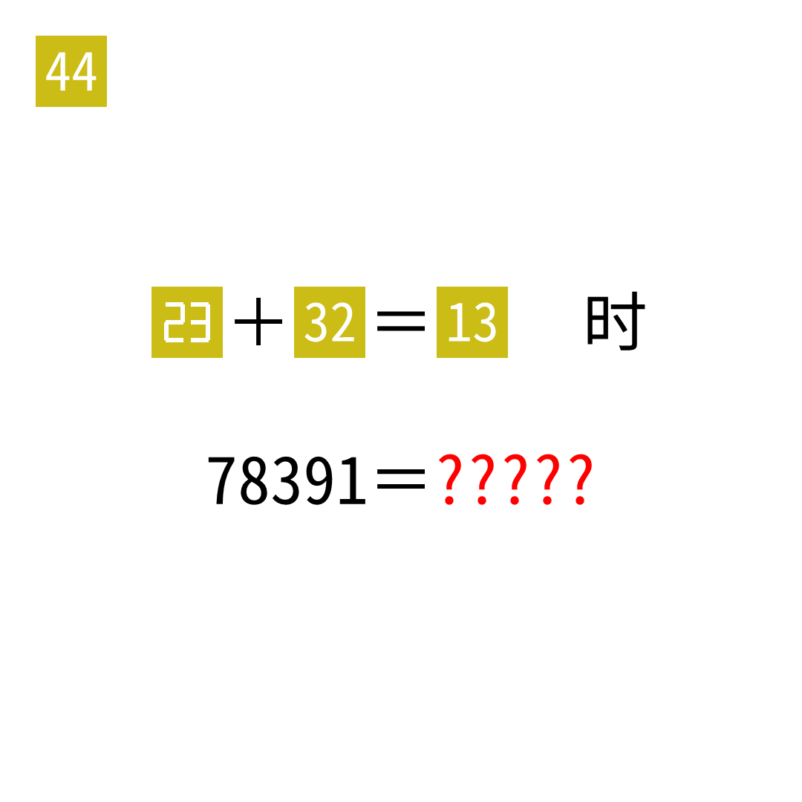

# 2025年度解谜能力测试 第 44 题

## 题面

## 答案

`CLOSE`

## 解析

本题为 cryptarithm，使用23、32、13的答案。

## 本地附件

- [05378011b0854659843a88c4d49eb8de.webp](../../../assets/static.cipherpuzzles.com/static/images/05378011b0854659843a88c4d49eb8de.webp)

来源：[https://ccbc16.cipherpuzzles.com/data/puzzle_script/c16-puzzle-solving-test.js#44](https://ccbc16.cipherpuzzles.com/data/puzzle_script/c16-puzzle-solving-test.js#44)
