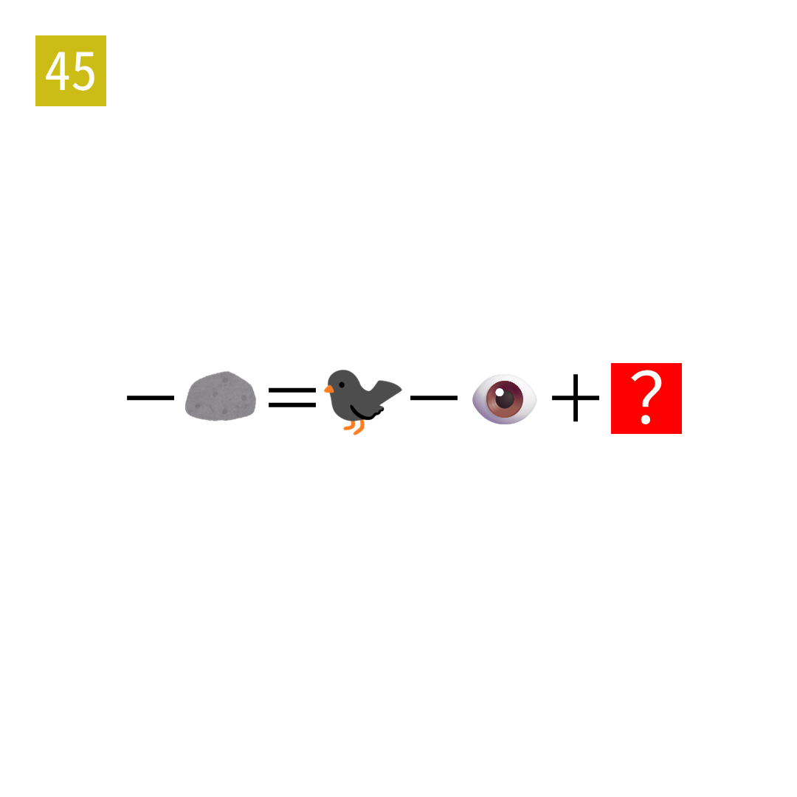

# 2025年度解谜能力测试 第 45 题

## 题面

## 答案

`行`

## 解析

这行写了两个成语，一石二鸟和一目十行。

## 本地附件

- [2450c40aa40b4ac0bb586469793dcb0b.webp](../../../assets/static.cipherpuzzles.com/static/images/2450c40aa40b4ac0bb586469793dcb0b.webp)

来源：[https://ccbc16.cipherpuzzles.com/data/puzzle_script/c16-puzzle-solving-test.js#45](https://ccbc16.cipherpuzzles.com/data/puzzle_script/c16-puzzle-solving-test.js#45)
