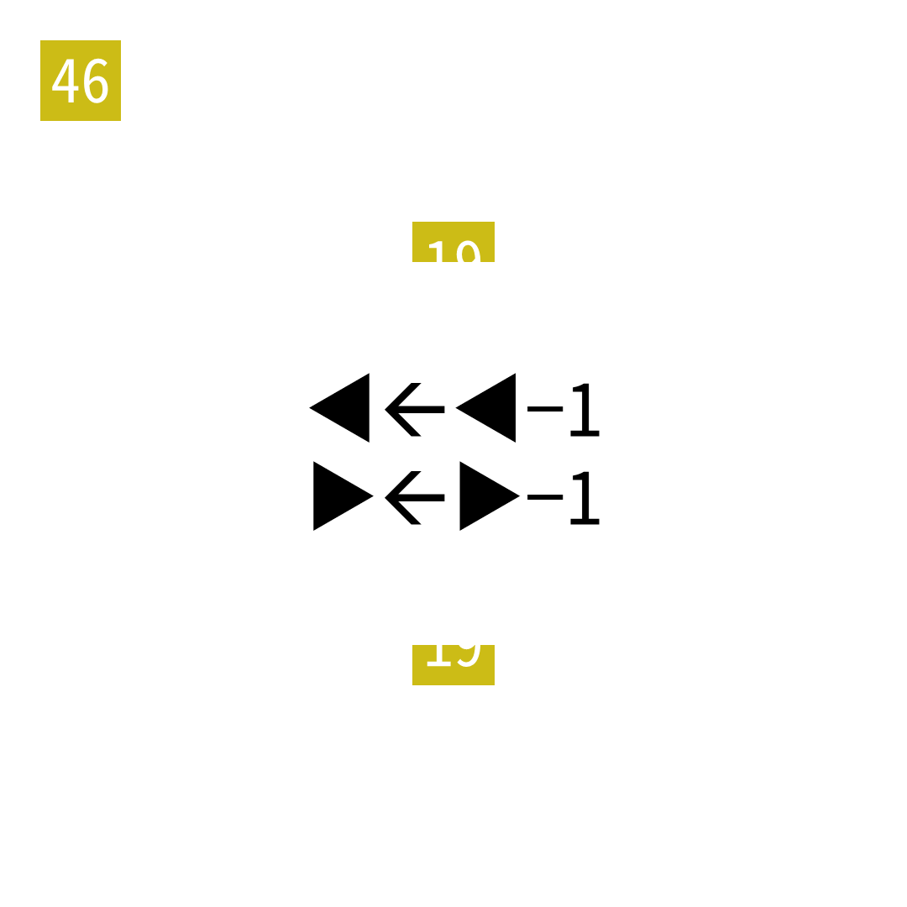

# 2025年度解谜能力测试 第 46 题

## 题面

## 答案

`AND`

## 解析

19题中的◀变为1，▶变为4。按照19题下半部分重新提取。

## 本地附件

- [69e5a164e83442c69b59b3489f2a9e57.webp](../../../assets/static.cipherpuzzles.com/static/images/69e5a164e83442c69b59b3489f2a9e57.webp)

来源：[https://ccbc16.cipherpuzzles.com/data/puzzle_script/c16-puzzle-solving-test.js#46](https://ccbc16.cipherpuzzles.com/data/puzzle_script/c16-puzzle-solving-test.js#46)
