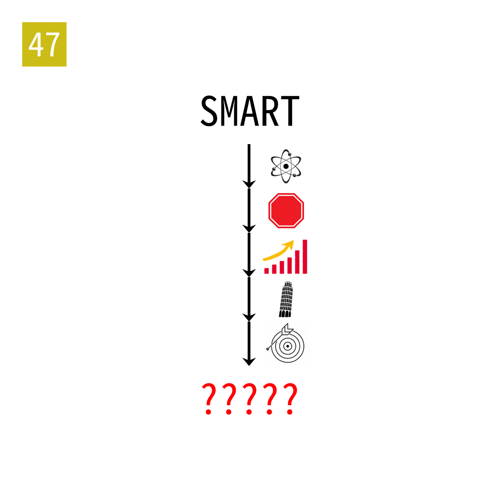

# 2025年度解谜能力测试 第 47 题

## 题面

## 答案

`ASSET`

## 解析

每个图片对应一个单词，单词的形式为xTOy或xISy。按顺序应用在起点单词SMART上。

## 本地附件

- [38d18189999e4662b6f402cf16a303a1.webp](../../../assets/static.cipherpuzzles.com/static/images/38d18189999e4662b6f402cf16a303a1.webp)

来源：[https://ccbc16.cipherpuzzles.com/data/puzzle_script/c16-puzzle-solving-test.js#47](https://ccbc16.cipherpuzzles.com/data/puzzle_script/c16-puzzle-solving-test.js#47)
