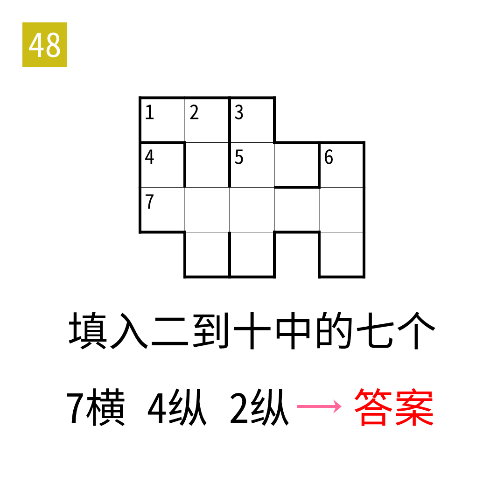

# 2025年度解谜能力测试 第 48 题

## 题面

## 答案

`鄂温克族`

## 解析

填入汉字的笔画。二到十中只有八和九没有使用。之后按照27中的箭头机制得到最终答案。

## 本地附件

- [079bf7f8ce274a72a3ced985ed2009c3.webp](../../../assets/static.cipherpuzzles.com/static/images/079bf7f8ce274a72a3ced985ed2009c3.webp)

来源：[https://ccbc16.cipherpuzzles.com/data/puzzle_script/c16-puzzle-solving-test.js#48](https://ccbc16.cipherpuzzles.com/data/puzzle_script/c16-puzzle-solving-test.js#48)
