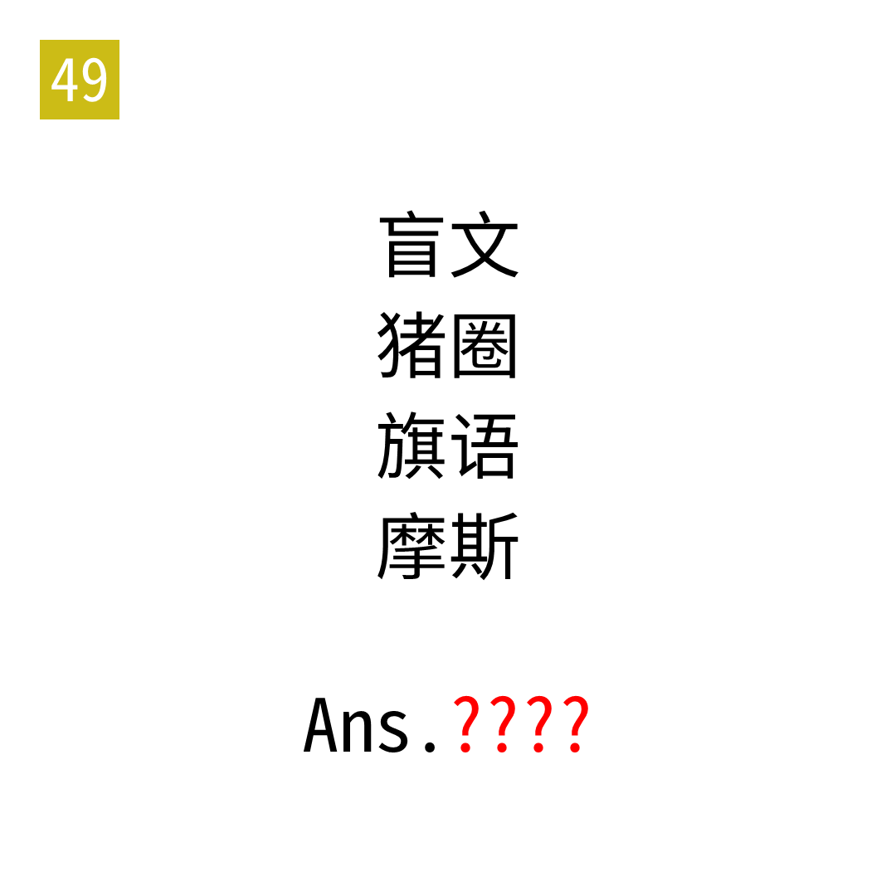

# 2025年度解谜能力测试 第 49 题

## 题面

## 答案

`CENT`

## 解析

四行分别对应30、25、11、31。将答案转为汉字后，象形对应的古典密码提取。例如，半对应C。

## 本地附件

- [5c36bb4765264ddb902780fd0198ee15.webp](../../../assets/static.cipherpuzzles.com/static/images/5c36bb4765264ddb902780fd0198ee15.webp)

来源：[https://ccbc16.cipherpuzzles.com/data/puzzle_script/c16-puzzle-solving-test.js#49](https://ccbc16.cipherpuzzles.com/data/puzzle_script/c16-puzzle-solving-test.js#49)
