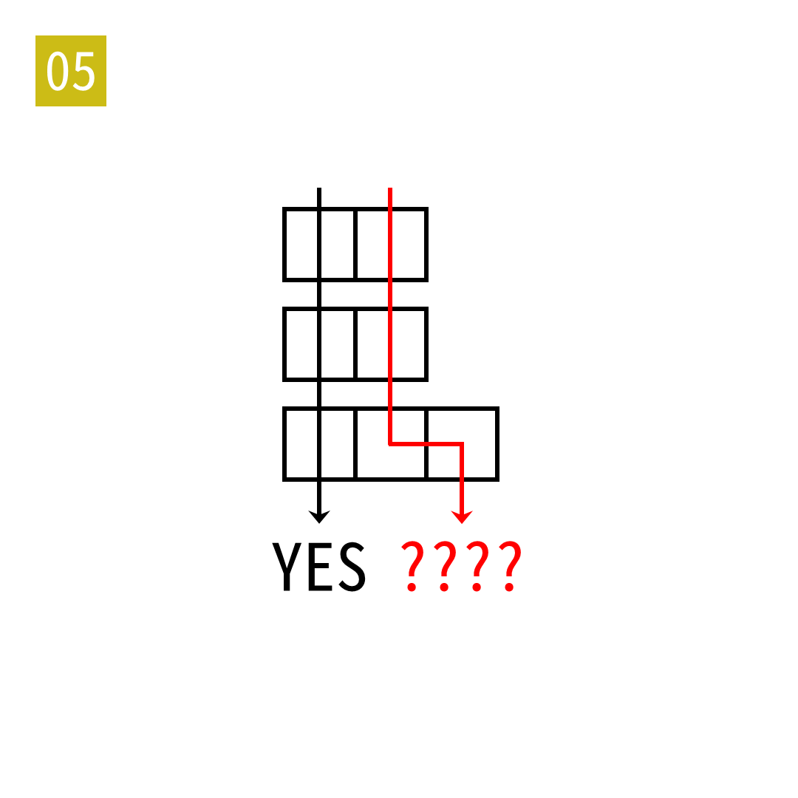

# 2025年度解谜能力测试 第 5 题

## 题面

## 答案

`IRAN`

## 解析

填入一二三的拼音。

## 本地附件

- [a5f1c72b2fc74f90b93b110f2db06312.webp](../../../assets/static.cipherpuzzles.com/static/images/a5f1c72b2fc74f90b93b110f2db06312.webp)

来源：[https://ccbc16.cipherpuzzles.com/data/puzzle_script/c16-puzzle-solving-test.js#5](https://ccbc16.cipherpuzzles.com/data/puzzle_script/c16-puzzle-solving-test.js#5)
