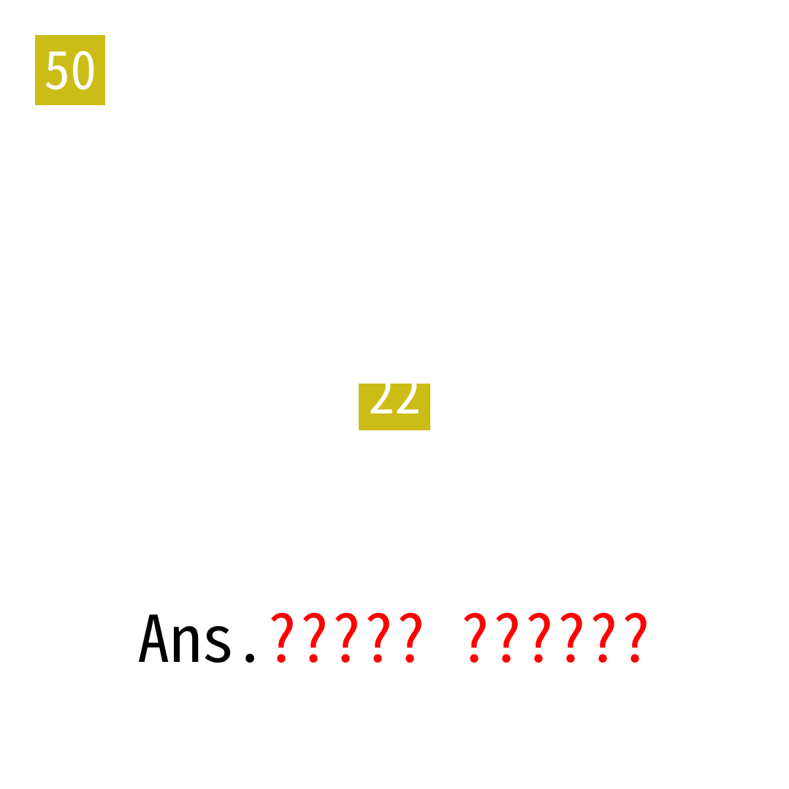

# 2025年度解谜能力测试 第 50 题

## 题面

## 答案

`TRANS ISOMER`

## 解析

按22的要求，提取所有答案的第二个字母，得到 YOU ARE AMAZING CHECK YOUR CHOICES AND GET YOUR FINAL ANSWER。五道选择题的选项组成“反式异构体”，翻译成英文得到答案。

## 本地附件

- [b85c8dcd5e70428f8bdd061d24379982.webp](../../../assets/static.cipherpuzzles.com/static/images/b85c8dcd5e70428f8bdd061d24379982.webp)

来源：[https://ccbc16.cipherpuzzles.com/data/puzzle_script/c16-puzzle-solving-test.js#50](https://ccbc16.cipherpuzzles.com/data/puzzle_script/c16-puzzle-solving-test.js#50)
