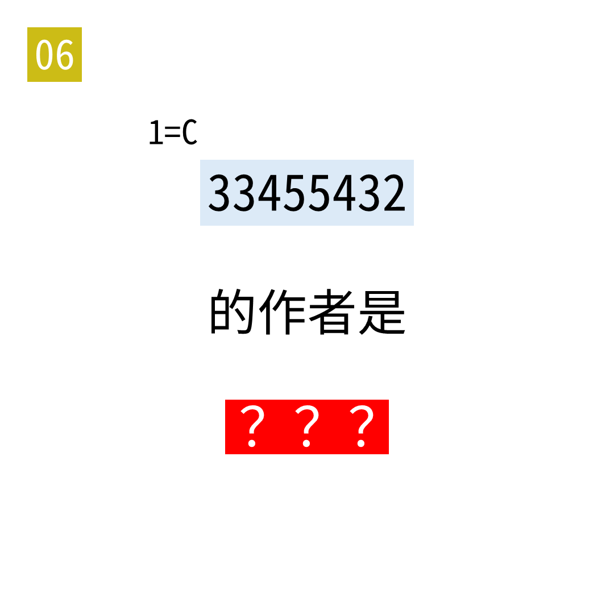

# 2025年度解谜能力测试 第 6 题

## 题面

## 答案

`贝多芬`

## 解析

1=C 提示简谱。33455432是《欢乐颂》的开头。

## 本地附件

- [3a2380f6e7ee46769bb2de390856f09d.webp](../../../assets/static.cipherpuzzles.com/static/images/3a2380f6e7ee46769bb2de390856f09d.webp)

来源：[https://ccbc16.cipherpuzzles.com/data/puzzle_script/c16-puzzle-solving-test.js#6](https://ccbc16.cipherpuzzles.com/data/puzzle_script/c16-puzzle-solving-test.js#6)
