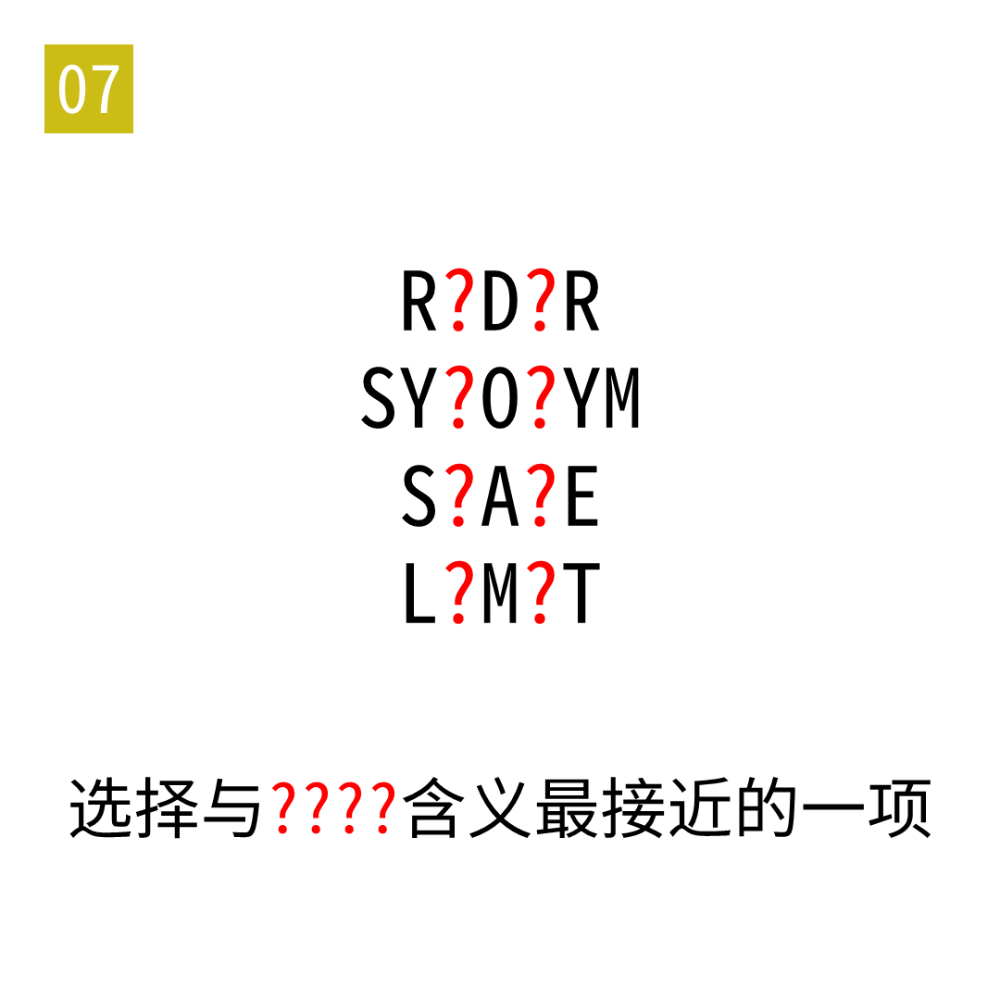

# 2025年度解谜能力测试 第 7 题

## 题面

## 答案

`反`

## 解析

每行的两个问号填入相同字母，形成单词 ANTI。

## 本地附件

- [17887b3ea73f486badf8cd78601fd04b.webp](../../../assets/static.cipherpuzzles.com/static/images/17887b3ea73f486badf8cd78601fd04b.webp)

来源：[https://ccbc16.cipherpuzzles.com/data/puzzle_script/c16-puzzle-solving-test.js#7](https://ccbc16.cipherpuzzles.com/data/puzzle_script/c16-puzzle-solving-test.js#7)
