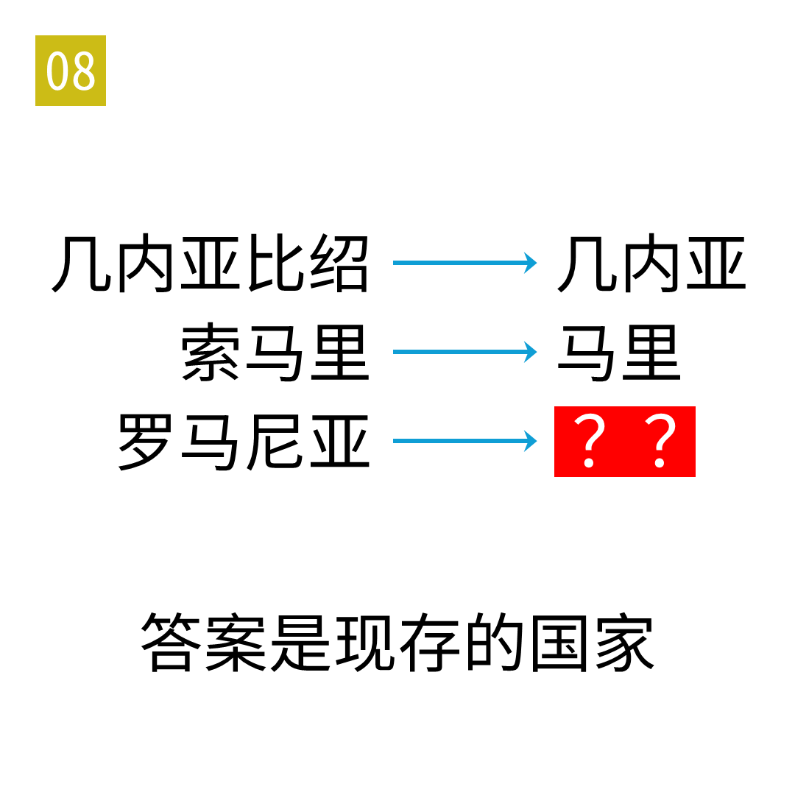

# 2025年度解谜能力测试 第 8 题

## 题面

## 答案

`阿曼`

## 解析

箭头表示终点国家的英文名是起点国家的英文名的子串。

## 本地附件

- [b06253b53a8f4567b74a83b676f9c092.webp](../../../assets/static.cipherpuzzles.com/static/images/b06253b53a8f4567b74a83b676f9c092.webp)

来源：[https://ccbc16.cipherpuzzles.com/data/puzzle_script/c16-puzzle-solving-test.js#8](https://ccbc16.cipherpuzzles.com/data/puzzle_script/c16-puzzle-solving-test.js#8)
