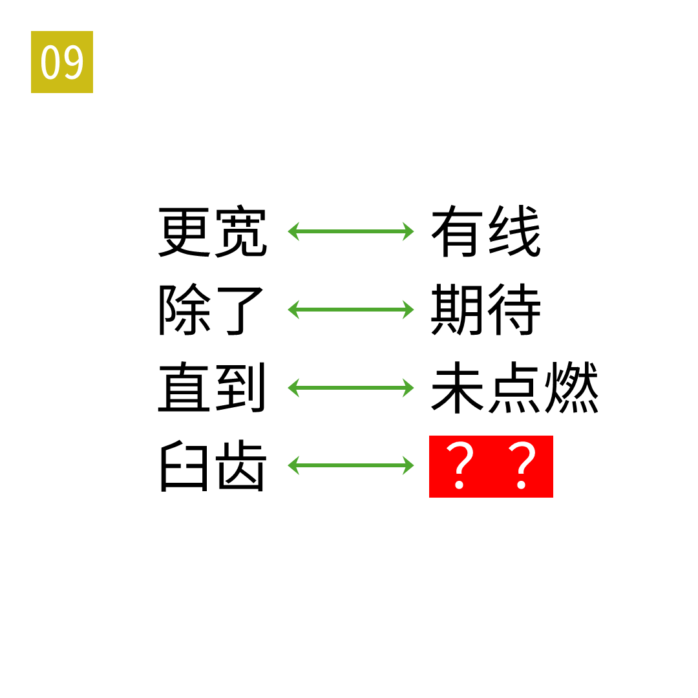

# 2025年度解谜能力测试 第 9 题

## 题面

## 答案

`道德`

## 解析

箭头表示交换（英文单词的）第三位和第五位。

## 本地附件

- [7bf183eb396b4d9192871b9983ad198d.webp](../../../assets/static.cipherpuzzles.com/static/images/7bf183eb396b4d9192871b9983ad198d.webp)

来源：[https://ccbc16.cipherpuzzles.com/data/puzzle_script/c16-puzzle-solving-test.js#9](https://ccbc16.cipherpuzzles.com/data/puzzle_script/c16-puzzle-solving-test.js#9)
