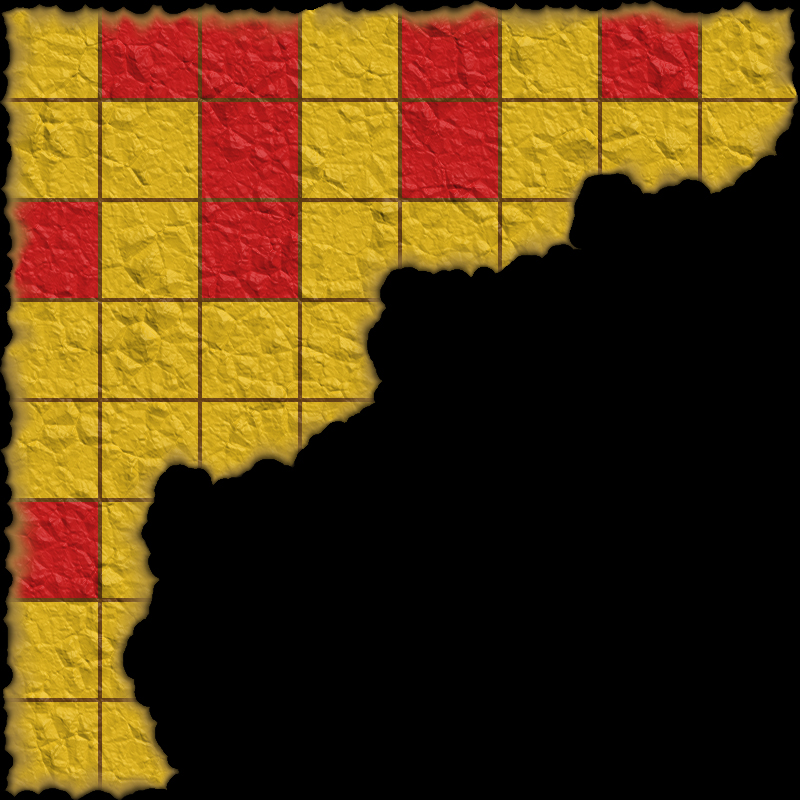

# CCBC 3 Final Meta

## 题面

“这些应该就是要救嫂子的第一步。”爱装深沉的羽摸着下巴着说。
再看看桌面上的32张纸，蔡巍深思了会，果断说道：“大家回去整理行李，看来这次的世界杯想不去也不行了，我们明天就出发，南木，待会和我一起去订机票！”
“你已经知道行程了么？”崇拜不已的南木出声询问。
“嗯，应该没错……”蔡巍对着白夜窃窃私语了一番。
“既然这样，老白你就别难过了，今晚好好休息，养足精神，明天开始踏上营救旅程！英雄救美完正好一起看世界杯决赛。”喜欢插科打诨的赢慕紫拍了拍白夜的肩膀。
就在大家准备撤离的时候，总能发现什么的小夜指着纸篓激动道：“你们看！这是什么？”
是一张烧了一半的羊皮纸，上面还有几个红色的小方块，这个也许是绑匪想要毁掉却又来不及消毁的证据！
“难道被烧掉的部分就是最后的答案？”白夜陷入了沉思……

“总之，先解决这32题谜题吧。”白夜慢慢地说道，仿佛已经恢复了平时的状态。
“好！”众人一致同意。
众人开始了营救白夜妻子之旅，一场巅峰的智力角逐已经拉开帷幕……

## 答案

_官方存档未提供答案。_

## 解析

_官方存档未填写解析。_

## 本地附件

- [5e51b48ebd4b2bacf01f3696.jpg](../../../assets/imgsa.baidu.com/_/pic/item/5e51b48ebd4b2bacf01f3696.jpg)

来源：[https://tieba.baidu.com/p/853440395?see_lz=1](https://tieba.baidu.com/p/853440395?see_lz=1)
