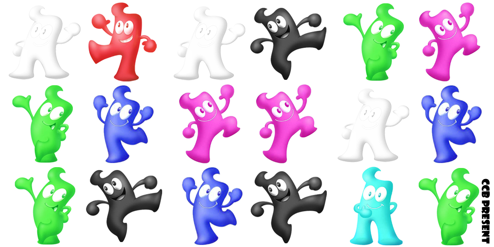

# 七色海宝

## 题面

## 答案

`Chilavert`

## 解析

_官方存档未填写解析。_

## 本地附件

- [36df4fc3f0153b77e4dd3b2e.jpg](../../../assets/imgsa.baidu.com/_/pic/item/36df4fc3f0153b77e4dd3b2e.jpg)

来源：[https://tieba.baidu.com/p/853440395?see_lz=1](https://tieba.baidu.com/p/853440395?see_lz=1)
