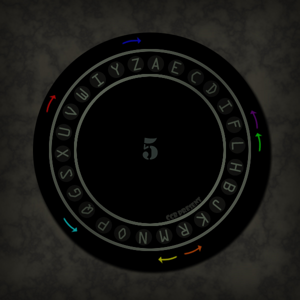

# 旋转

## 题面

## 答案

`Algeria`

## 解析

_官方存档未填写解析。_

## 本地附件

- [651ad14226cf6f5172f05d33.jpg](../../../assets/imgsa.baidu.com/_/pic/item/651ad14226cf6f5172f05d33.jpg)

来源：[https://tieba.baidu.com/p/853440395?see_lz=1](https://tieba.baidu.com/p/853440395?see_lz=1)
