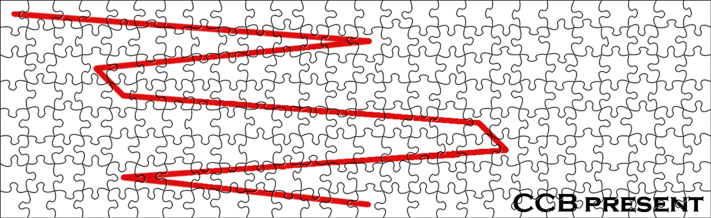

# 折线

## 题面

## 答案

`Andersen`

## 解析

_官方存档未填写解析。_

## 本地附件

- [8af09e2eb072967a1e30892a.jpg](../../../assets/imgsa.baidu.com/_/pic/item/8af09e2eb072967a1e30892a.jpg)

来源：[https://tieba.baidu.com/p/853440395?see_lz=1](https://tieba.baidu.com/p/853440395?see_lz=1)
