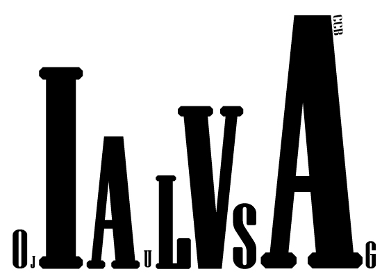

# 明显

## 题面

## 答案

`Jugoslavia`

## 解析

_官方存档未填写解析。_

## 本地附件

- [0ccbad3554010cf5d1a2d332.jpg](../../../assets/imgsa.baidu.com/_/pic/item/0ccbad3554010cf5d1a2d332.jpg)

来源：[https://tieba.baidu.com/p/853440395?see_lz=1](https://tieba.baidu.com/p/853440395?see_lz=1)
