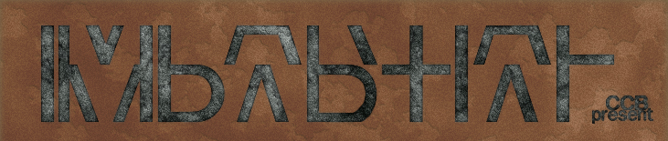

# 第一幕・房间 2

## 题面

“这些符号真是锈得可爱啊……”
“两种锈迹，也就是两种材质，不过这谜题倒是够简单的……”

## 答案

_官方存档未提供答案。_

## 解析

_官方存档未填写解析。_

## 本地附件

- [efab513dd0a806863d6d979e.jpg](../../../assets/imgsrc.baidu.com/forum/pic/item/efab513dd0a806863d6d979e.jpg)

来源：[https://tieba.baidu.com/p/1165694441?see_lz=1](https://tieba.baidu.com/p/1165694441?see_lz=1)
