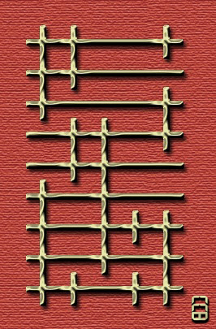

# 第一幕・房间 7

## 题面

“又是奇怪的符号……”
“是啊……而且是一团奇怪的符号……”

## 答案

_官方存档未提供答案。_

## 解析

_官方存档未填写解析。_

## 本地附件

- [6577cffcdb69d5eab801a05d.jpg](../../../assets/imgsrc.baidu.com/forum/pic/item/6577cffcdb69d5eab801a05d.jpg)

来源：[https://tieba.baidu.com/p/1165694441?see_lz=1](https://tieba.baidu.com/p/1165694441?see_lz=1)
