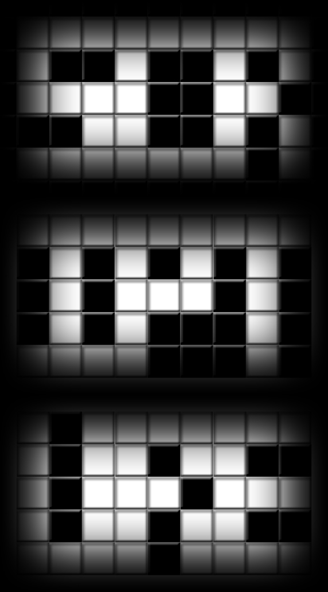

# 第一幕・房间 13

## 题面

_官方存档未提供可提取的文字题面；请查看下方附件或交互源码。_

## 答案

`scripture`

## 解析

答案：scripture

解法：根据光的三原色分解，象形可得答案。

## 本地附件

- [53de8c54406513753b29352c.jpg](../../../assets/imgsrc.baidu.com/forum/pic/item/53de8c54406513753b29352c.jpg)

来源：[https://tieba.baidu.com/p/1165694441?see_lz=1](https://tieba.baidu.com/p/1165694441?see_lz=1)
