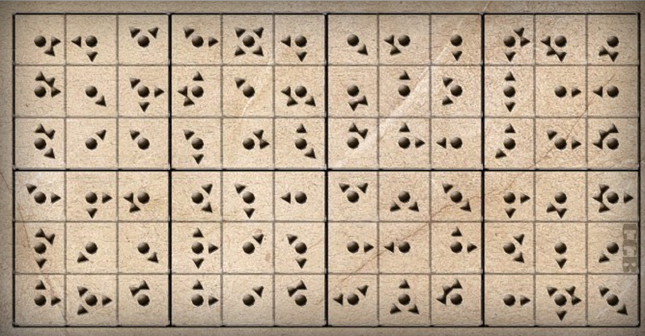

# 第二幕（下）・房间 1

## 题面

轰隆一声，大门应声而开，两人通过新打开的路来到了四层，令两人感到吃惊的是，这一层的装置布置地和三层如出一辙。
“在这儿！”蔡巍招呼我过来，“和下一层的图形一模一样……”
“不行，和下面的解法完全不一样啊……”

## 答案

_官方存档未提供答案。_

## 解析

_官方存档未填写解析。_

## 本地附件

- [43937d1eb19b9d9e1ad57658.jpg](../../../assets/imgsrc.baidu.com/forum/pic/item/43937d1eb19b9d9e1ad57658.jpg)

来源：[https://tieba.baidu.com/p/1181018380?see_lz=1](https://tieba.baidu.com/p/1181018380?see_lz=1)
