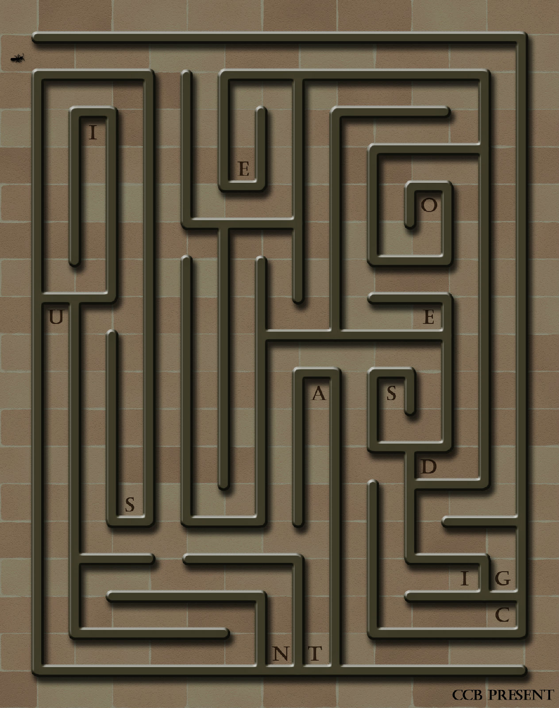

# 第二幕（下）・房间 2

## 题面

“呵呵，我开始喜欢上这个塔了……”
“是啊，感觉像智力闯关一样……”蔡巍掏出笔记本，“这题应该不成问题。”

## 答案

_官方存档未提供答案。_

## 解析

_官方存档未填写解析。_

## 本地附件

- [55e6d0a20d6aa2c7caefd03e.jpg](../../../assets/imgsrc.baidu.com/forum/pic/item/55e6d0a20d6aa2c7caefd03e.jpg)

来源：[https://tieba.baidu.com/p/1181018380?see_lz=1](https://tieba.baidu.com/p/1181018380?see_lz=1)
