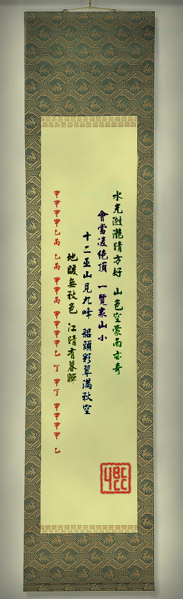

# 第二幕（下）・房间 3

## 题面

“我突然感觉穿越了……”
“呃……我在下一层就已经决定不大惊小怪了……”
“这些文字……难道是在暗示穿越时空的能力么……”

## 答案

_官方存档未提供答案。_

## 解析

_官方存档未填写解析。_

## 本地附件

- [5df0cd112415d47ab8127b3e.jpg](../../../assets/imgsrc.baidu.com/forum/pic/item/5df0cd112415d47ab8127b3e.jpg)

来源：[https://tieba.baidu.com/p/1181018380?see_lz=1](https://tieba.baidu.com/p/1181018380?see_lz=1)
